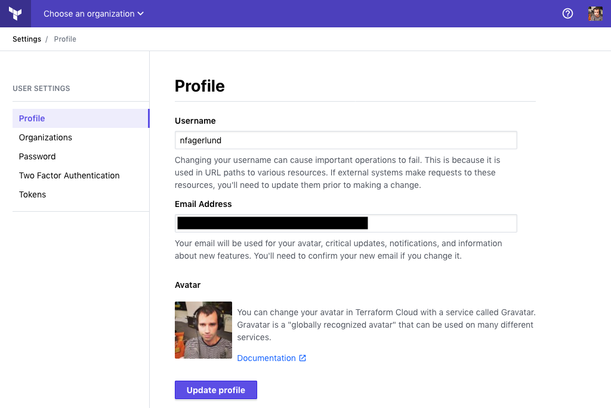
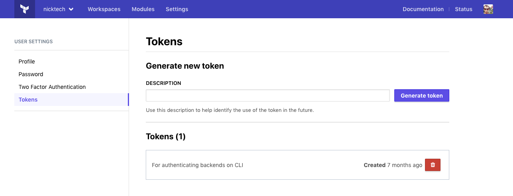

[organizations]: ./organizations.html
[teams]: ./teams.html

# Users

Users are the individual members of an [organization][organizations].

## Creating an Account

Users must create an account in Terraform Enterprise (TFE) before
they can be added to an organization. Creating an account requires a username, an email address, and a password.

The sign-up page is not linked from TFE's sign-in page, so you should provide the sign-up URL to any colleagues you want to invite to TFE:

- For the SaaS version of TFE, create a new account at [https://app.terraform.io/account/new](https://app.terraform.io/account/new).
- For private installs of TFE, go to `https://<TFE HOSTNAME>/account/new`.

New users do not belong to any organizations.

After you create a new user account, TFE immediately takes you to a page where you can create a new organization.

- If you are the first TFE user in your organization, use this page to create your TFE organization. See [Organizations][] for more information.
- If you intend to join an existing organization, do not create a new one; instead, send your username to one of your TFE organization's owners and ask them to add you to a team. Once they have brought you into the organization, you can reload the page to begin using TFE.

## Team and Organization Membership

To add a user to an organization, a member of that organization's owners team must add them to one or more teams. See [Teams][] for more information.

Adding a user to a team requires only their username.

## Site Admin Permissions

On private instances of TFE, some user accounts have a special "site admin" permission that allows administration of the entire instance.

Admin permissions are distinct from normal organization-level permissions, and they apply to a different set of UI controls and API endpoints. Although admin users can administer any resource across the instance when using the site admin pages or the [admin API](../api/admin/index.html), they have a normal user's permissions (with access determined by the teams they belong to) when using an organization's standard UI controls and API endpoints.

For more information, see [Administering Private Terraform Enterprise](../private/admin/index.html).

## User Settings

-> **API:** See the [Account API](../api/account.html).

TFE users can manage many of their own account details, including email address, password, API tokens, and two-factor authentication.

To reach your user settings page, click the user icon in the upper right corner and choose "User Settings" from the menu.

Once on this page, can use the navigation on the left to choose which settings to manage.

### Profile

TFE user profiles are very small, consisting only of a username and an email address. You can change either of these from the "Profile" page of the user settings.

~> **Important:** Changing your username can cause important operations to fail. This is because it is used in URL paths to various resources. If external systems make requests to these resources, you'll need to update them prior to making a change.

Additionally, TFE uses [Gravatar](http://en.gravatar.com) to display a user icon if you have associated one with your email address. For details about changing your user icon, see [Gravatar's documentation](http://en.gravatar.com/support/).

### Password Management

Users manage their own passwords. To change your password, click the "Password" page of the user settings. You'll need to confirm your current password, and enter your new password twice.

Password management isn't available if your TFE installation uses [SAML single sign on](../saml/index.html).

### Two-Factor Authentication

For additional security, you can enable two-factor authentication, using a TOTP-compliant application or an SMS-capable phone number. Depending on your organization's policies, you might be required to enable two-factor authentication.

For more details, see [Two-Factor Authentication](./2fa.html).

### API Tokens

Users can create any number of API tokens, and can revoke existing tokens at any time. To manage API tokens, click the "Tokens" page of the user settings.

API tokens are necessary for:

- Authenticating with the [Terraform Enterprise API](../api/index.html). API calls require an `Authorization: Bearer <TOKEN>` HTTP header.
- Authenticating with the [Terraform `atlas` backend](/docs/backends/types/terraform-enterprise.html). The backend looks for a token in the `ATLAS_TOKEN` environment variable.
- Using [private modules](../registry/using.html) in command-line Terraform runs on local machines. This requires [a `credentials` block](../registry/using.html#configuration) in your `~/.terraformrc` file.

Terraform Enterprise has three kinds of API tokens: user, team, and organization. For more information about team and organization tokens, see [Service Accounts](./service-accounts.html).

Protect your tokens carefully, because they can do anything your user account can. For example, if you belong to a team with write access to a workspace, your API token can edit variables in that workspace. (See [Permissions](./permissions.html) for details about workspace permissions.)

Since users can be members of multiple organizations, user tokens work with any organization their user belongs to.

- To create a new token, enter a comment to identify it and click the "Generate token" button.

    A token is only displayed once, at the time of creation; if you lose it, you will need to revoke the old token and create a new one. Make sure your description includes enough information so you know which token to revoke later.
- To revoke a token, click the "🗑" (trash can) icon button next to the token's description. That token will no longer be able to authenticate as your user account.

-> **Note**: When SAML SSO is enabled there is a session timeout for user API tokens, forcing users to periodically reauthenticate through the web UI in order to keep their tokens active. See the [API Token Expiration](/docs/enterprise/saml/login.html#api-token-expiration) section in the SAML SSO documentation for more details.
