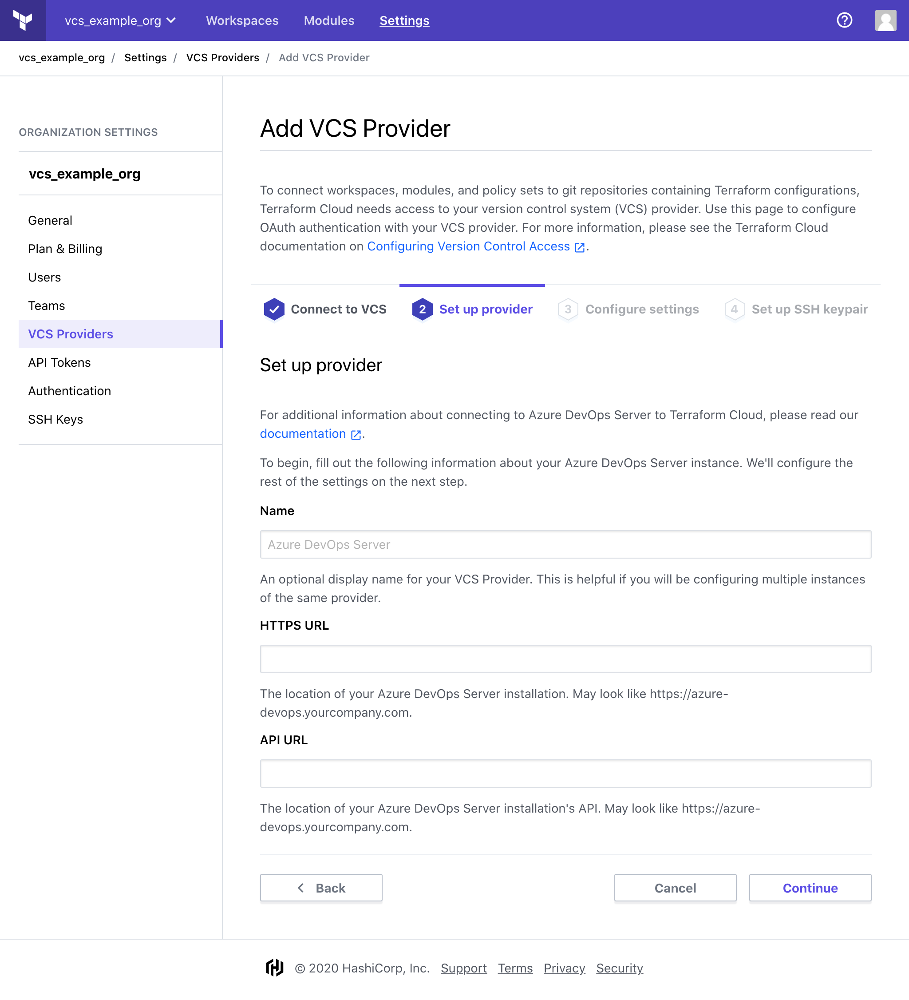
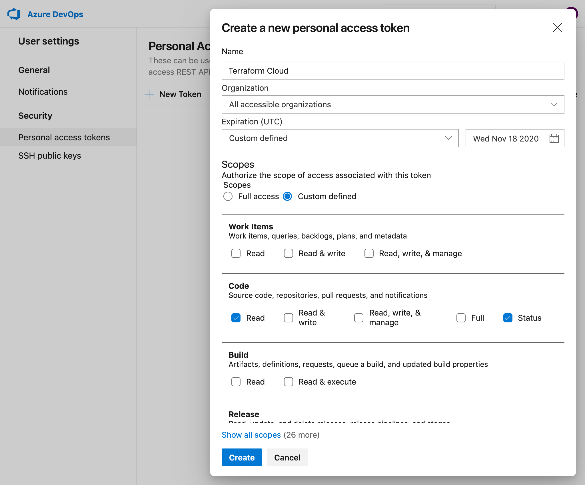
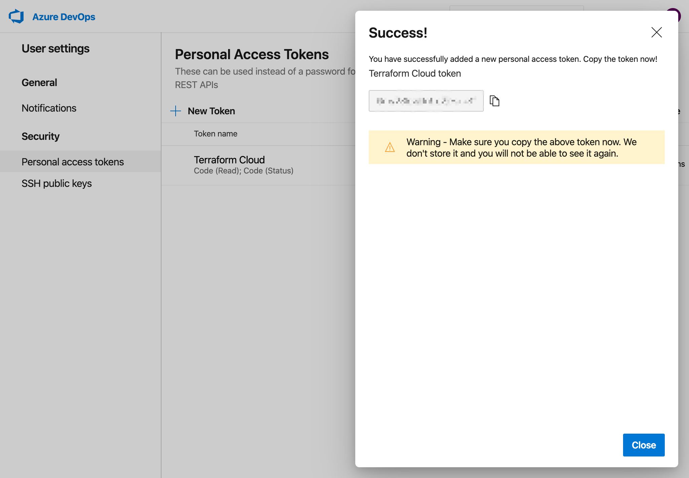
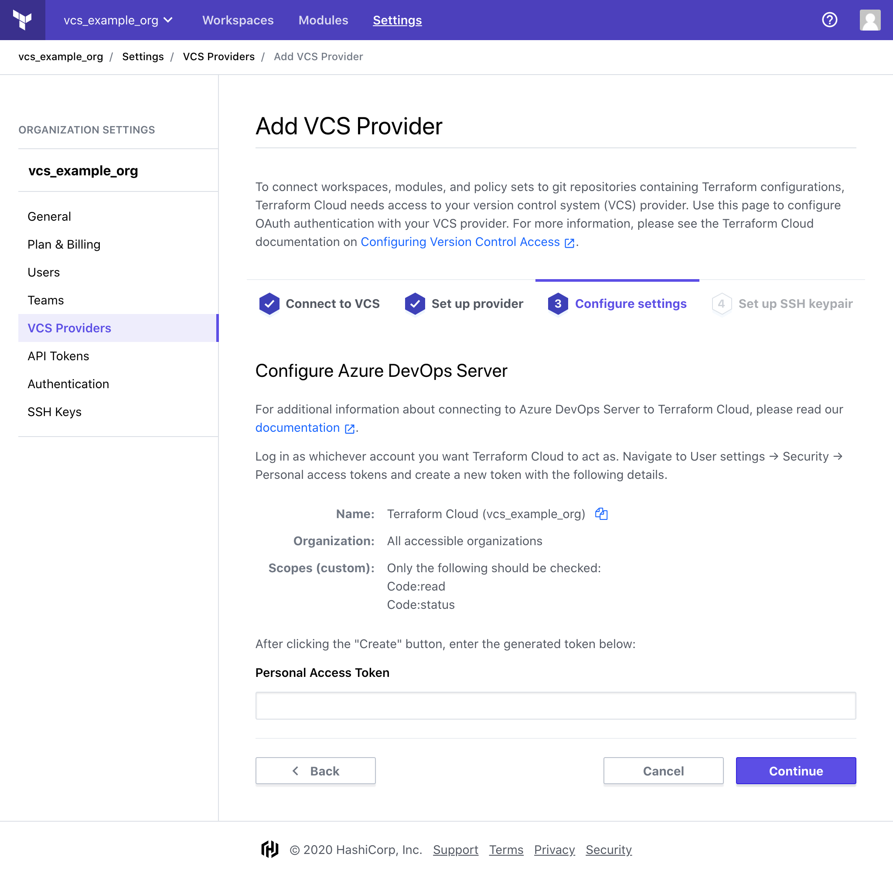
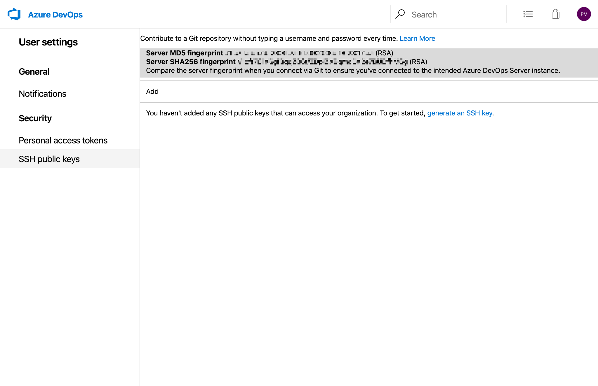

# Configuring Azure DevOps Server Access

These instructions are for using an on-premises installation of Azure DevOps Server 2019 for Terraform Cloud's VCS features. [Azure DevOps Services has separate instructions,](./azure-devops-services.html) as do the [other supported VCS providers.](./index.html)

Configuring a new VCS provider requires permission to manage VCS settings for the organization. ([More about permissions.](/docs/cloud/users-teams-organizations/permissions.html))

[permissions-citation]: #intentionally-unused---keep-for-maintainers

## Important Notes About Authentication

Terraform Cloud uses personal access tokens to connect to Azure DevOps Server. This access method requires some additional configuration and ongoing maintenance:

- [IIS Basic Authentication must be disabled](https://docs.microsoft.com/en-us/azure/devops/integrate/get-started/authentication/iis-basic-auth?view=azure-devops) on your Azure DevOps Server instance in order to use personal access tokens.
- Personal access tokens eventually expire, with a maximum allowed lifetime of one year. If Terraform Cloud's token expires, it will be unable to connect to Azure DevOps Server until the token is replaced. To avoid a gap in service, do one of the following before the token expires:
    - Update the expiration date of the existing token within Azure DevOps Server.
    - Create a new token, and edit Terraform Cloud's VCS connection to use it.

## Step 1: On Terraform Cloud, Begin Adding a New VCS Provider

1. Open Terraform Cloud in your browser and navigate to the Settings > VCS Providers page for your organization. Click the "Add VCS Provider" button.

    If you just created your organization, you might already be on this page. Otherwise:

    1. Make sure the upper-left organization menu currently shows your organization.
    1. Click the "Settings" link at the top of the page (or within the &#9776; menu)
    1. On the next page, click "VCS Providers" in the left sidebar
    1. Click the "Add a VCS Provider" button

1. The next page has several steps to guide you through adding a new VCS provider.

    For the first step, select "Azure DevOps" then select "Azure DevOps Server" from the dropdown. The page will move to the next step.

1. On the "Set up provider" step there are three textboxes. Enter an optional **Name** for this VCS connection. Enter the instance URL for your Azure DevOps Server in **HTTP URL** and **API URL** textboxes. Click the "Continue" button to continue to the next step.

    

Leave the page open in a browser tab. In the next step you will copy values from this page, and in later steps you will continue configuring Terraform Cloud.

## Step 2: On Azure DevOps Server, Create a New Personal Access Token

1. In a new browser tab, open your Azure DevOps Server instance and log in as whichever account you want Terraform Cloud to act as. For most organizations this should be a dedicated service user, but a personal account will also work.

    ~> **Important:** The account you use for connecting Terraform Cloud **must have Project Collection Administrator access** to any projects containing repositories of Terraform configurations, since creating webhooks requires these permissions. It is not possible to create custom access roles with lower levels of privilege, as Microsoft does not currently allow delegation of this capability.

2. Navigate to User settings -> Security -> Personal access tokens.

3. Click the "New Token" button to generate a new personal access token with "Code (Read)" and "Code (Status)" scopes. (We recommend also granting access to "All accessible organizations.")

    

4. Copy the generated token to your clipboard; you'll paste it in the next step. Leave this page open in a browser tab.

    

## Step 3: On Terraform Cloud, Add the Personal Access Token

1. On the "Configure settings" step there is one textbox. Enter your Azure DevOps Server **Personal Access Token** from Step 2. Click the "Continue" button to continue to the next step.

    

## Step 4: On Workstation, Create an SSH Key for Terraform Cloud

On a secure workstation, create an SSH keypair that Terraform Cloud can use to connect to Azure DevOps Server. The exact command depends on your OS, but is usually something like `ssh-keygen -t rsa -m PEM -f "/Users/<NAME>/.ssh/service_terraform" -C "service_terraform_enterprise"`. This creates a `service_terraform` file with the private key, and a `service_terraform.pub` file with the public key.

This SSH key **must have an empty passphrase.** Terraform Cloud cannot use SSH keys that require a passphrase.

### Important Notes

- Do not use your personal SSH key to connect Terraform Cloud and Azure DevOps Server; generate a new one or use an existing key reserved for service access.
- In the following steps, you must provide Terraform Cloud with the private key. Although Terraform Cloud does not display the text of the key to users after it is entered, it retains it and will use it for authenticating to Azure DevOps Server.
- **Protect this private key carefully.** It can read code to the repositories you use to manage your infrastructure. Take note of your organization's policies for protecting important credentials and be sure to follow them.

## Step 5: On Azure Devops Server, Add SSH Public Key

1. Navigate to User settings -> Security -> SSH public keys on your Azure DevOps Server instance.

    

2. Click the "Add" button. Paste the text of the **SSH public key** you created in step 3 (from the `.pub` file) into the text field, then click the "Add key" button to confirm.

    

## Step 6: On Terraform Cloud, Add SSH Private Key

1. Go back to your Terraform Cloud browser tab and paste the text of the **SSH private key** you created in step 3 into the **Private SSH Key** text field of the "Set up SSH keypair" step. Click the "Add SSH key" button.

    

## Finished

At this point, Azure DevOps Server access for Terraform Cloud is fully configured, and you can create Terraform workspaces based on your organization's repositories.
