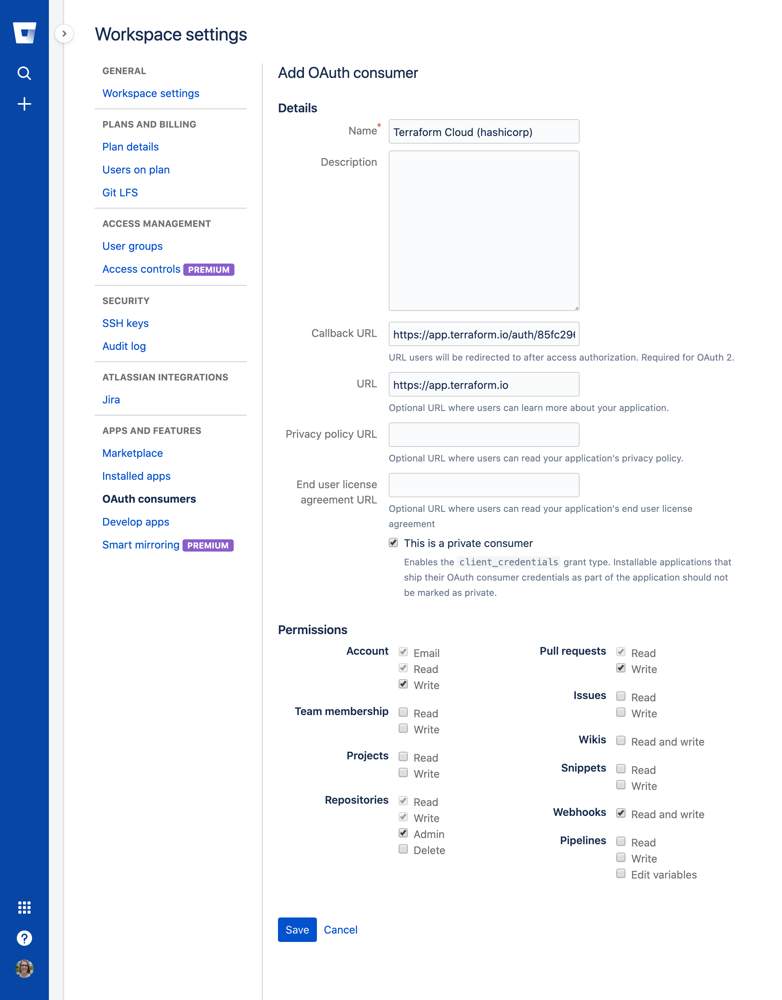
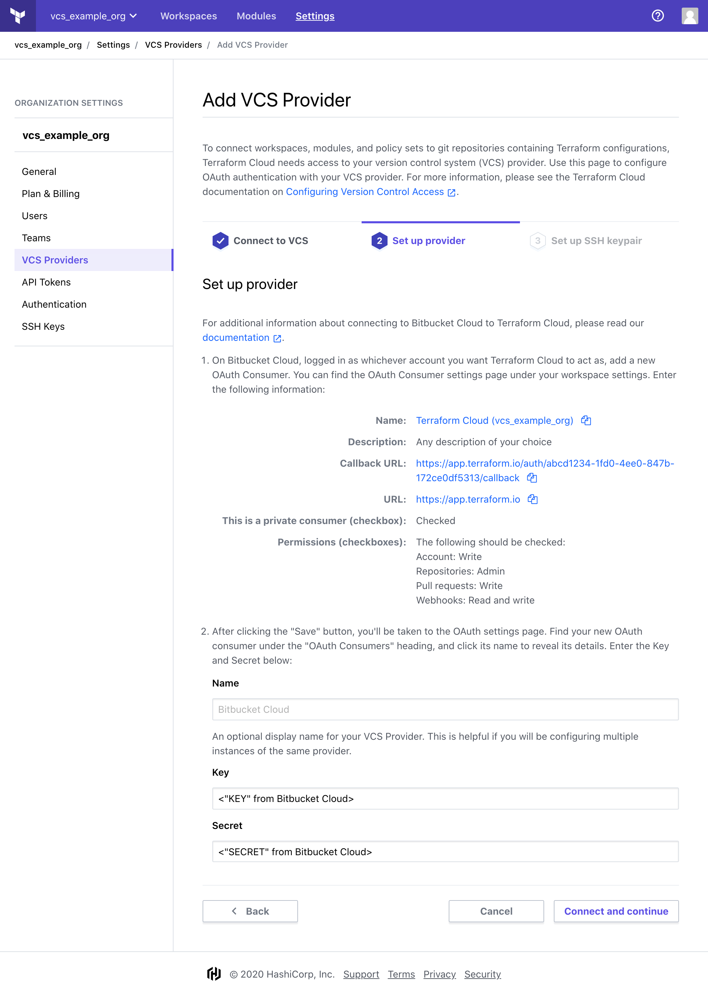
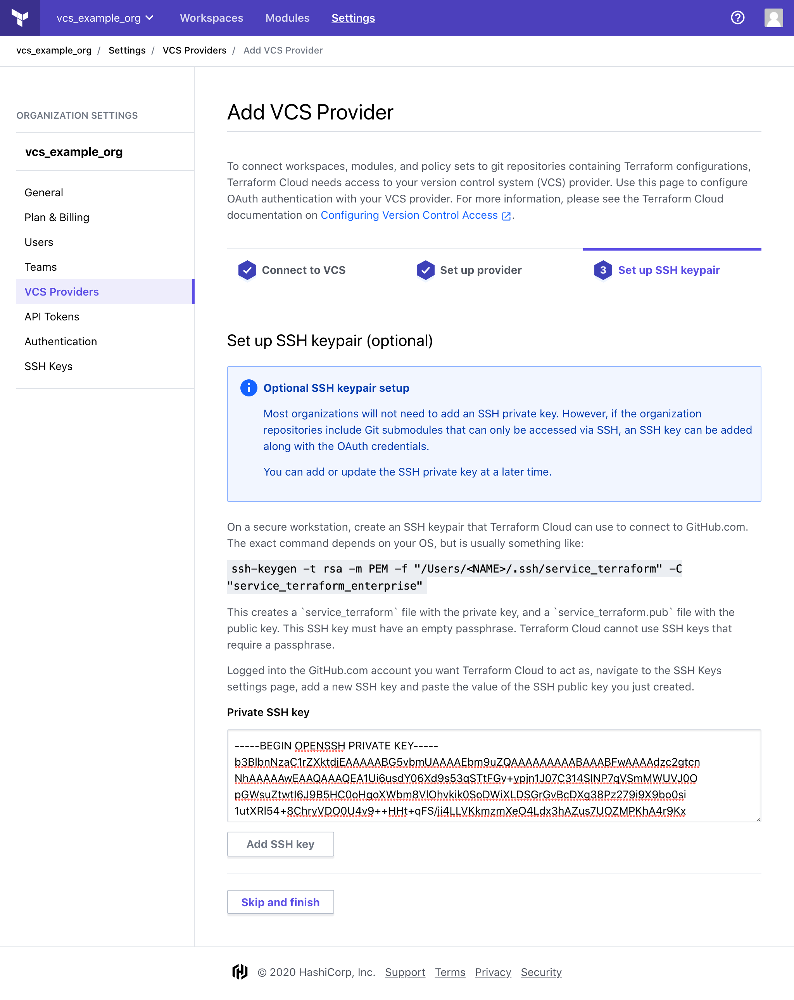

# Configuring Bitbucket Cloud Access

These instructions are for using Bitbucket Cloud for Terraform Cloud's VCS features. Bitbucket Cloud is the cloud-hosted version of Bitbucket; [self-hosted Bitbucket Server instances have separate instructions,](./bitbucket-server.html) as do the [other supported VCS providers.](./index.html)

Connecting Terraform Cloud to your VCS involves four steps:

On your VCS | On Terraform Cloud
--|--
&nbsp; | Create a new connection in Terraform Cloud. Get callback URL.
Register your Terraform Cloud organization as a new app. Provide callback URL. Get ID and key. | &nbsp;
&nbsp; | Provide Terraform Cloud with ID and key. Request VCS access.
Approve access request. | &nbsp;

The rest of this page explains the Bitbucket Cloud-specific versions of these steps.

## Step 1: On Terraform Cloud, Begin adding a VCS Provider

1. Open Terraform Cloud in your browser and navigate to the "VCS Providers" settings for your organization. Click the "Add VCS Provider" button.

    If you just created your organization, you might already be on this page. Otherwise:

    1. Make sure the upper-left organization menu currently shows your organization.
    1. Click the "Settings" link at the top of the page (or within the &#9776; menu)
    1. On the next page, click "VCS Providers" in the left sidebar.
    1. Click the "Add VCS Provider" button.

1. The "Add VCS Provider" page is divided into multiple steps to guide you through adding a new VCS provider.

    For the first step, select "Bitbucket" then select "Bitbucket Cloud" from the dropdown. The page will move to the next step.

Leave the page open in a browser tab. In the next step you will copy values from this page, and in later steps you will continue configuring Terraform Cloud.

## Step 2: On Bitbucket Cloud, Create a New OAuth Consumer

1. In a new browser tab, open [Bitbucket Cloud](https://bitbucket.org) and log in as whichever account you want Terraform Cloud to act as. For most organizations this should be a dedicated service user, but a personal account will also work.

    ~> **Important:** The account you use for connecting Terraform Cloud **must have admin access** to any shared repositories of Terraform configurations, since creating webhooks requires admin permissions.

1. Navigate to Bitbucket's "Add OAuth Consumer" page.

    This page is located at `https://bitbucket.org/<YOUR WORKSPACE NAME>/workspace/settings/oauth-consumers/new`. You can also reach it through Bitbucket's menus:
    - In the lower left corner, click your profile picture and choose the workspace you want to access.
    - In the workspace navigation, click "Settings".
    - In the settings navigation, click "OAuth consumers," which is in the "Apps and Features" section.
    - On the OAuth settings page, click the "Add consumer" button.

1. This page has a form with several text fields and checkboxes.

    Fill out the fields and checkboxes with the corresponding values currently displayed in your Terraform Cloud browser tab. Terraform Cloud lists the values in the order they appear, and includes controls for copying values to your clipboard.

    

    Fill out the text fields as follows:

    Field            | Value
    -----------------|--------------------------------------------------
    Name             | Terraform Cloud (`<YOUR ORGANIZATION NAME>`)
    Description      | Any description of your choice.
    Callback URL     | `https://app.terraform.io/<YOUR CALLBACK URL>`
    URL              | `https://app.terraform.io` (or the URL of your Terraform Enterprise instance)

    Ensure that the "This is a private consumer" option is checked. Then, activate the following permissions checkboxes:

    Permission type | Permission level
    ----------------|-----------------
    Account         | Write
    Repositories    | Admin
    Pull requests   | Write
    Webhooks        | Read and write

1. Click the "Save" button, which returns you to the OAuth settings page.

1. Find your new OAuth consumer under the "OAuth Consumers" heading, and click its name to reveal its details.

    Leave this page open in a browser tab. In the next step, you will copy and paste the unique **Key** and **Secret.**

    

## Step 3: On Terraform Cloud, Set up Your Provider

1. Enter the **Key** and **Secret** from the previous step, as well as an optional **Name** for this VCS connection.

    

1. Click "Connect and continue." This takes you to a page on Bitbucket Cloud asking whether you want to authorize the app.

1. Click the blue "Grant access" button to proceed.

## Step 4: On Terraform Cloud, Set Up SSH Keypair (Optional)

Most organizations will not need to add an SSH private key. However, if the organization's repositories include Git submodules that can only be accessed via SSH, an SSH key can be added along with the OAuth credentials. You can add or update the SSH private key at a later time.

### Important Notes

- Do not use your personal SSH key to connect Terraform Cloud and Bitbucket Cloud; generate a new one or use an existing key reserved for service access.
- In the following steps, you must provide Terraform Cloud with the private key. Although Terraform Cloud does not display the text of the key to users after it is entered, it retains it and will use it for authenticating to Bitbucket Cloud.
- **Protect this private key carefully.** It can push code to the repositories you use to manage your infrastructure. Take note of your organization's policies for protecting important credentials and be sure to follow them.

### If You Don't Need an SSH Keypair:

1. Click the "Skip and Finish" button. This returns you to Terraform Cloud's VCS Providers page, which now includes your new Bitbucket Cloud client.

### If You Do Need an SSH Keypair:

1. On a secure workstation, create an SSH keypair that Terraform Cloud can use to connect to Bitbucket Cloud. The exact command depends on your OS, but is usually something like:
   `ssh-keygen -t rsa -m PEM -f "/Users/<NAME>/.ssh/service_terraform" -C "service_terraform_enterprise"`.
   This creates a `service_terraform` file with the private key, and a `service_terraform.pub` file with the public key. This SSH key **must have an empty passphrase**. Terraform Cloud cannot use SSH keys that require a passphrase.

2. While logged into the Bitbucket Cloud account you want Terraform Cloud to act as, navigate to the SSH Keys settings page, add a new SSH key, and paste the value of the SSH public key you just created.

3. In Terraform Cloud's "Add VCS Provider" page, paste the text of the **SSH private key** you just created, and click the "Add SSH Key" button.

    

## Finished

At this point, Bitbucket Cloud access for Terraform Cloud is fully configured, and you can create Terraform workspaces based on your organization's shared repositories.

