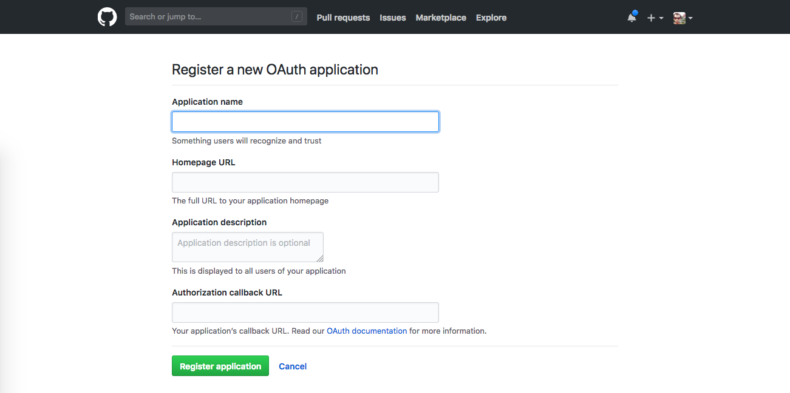
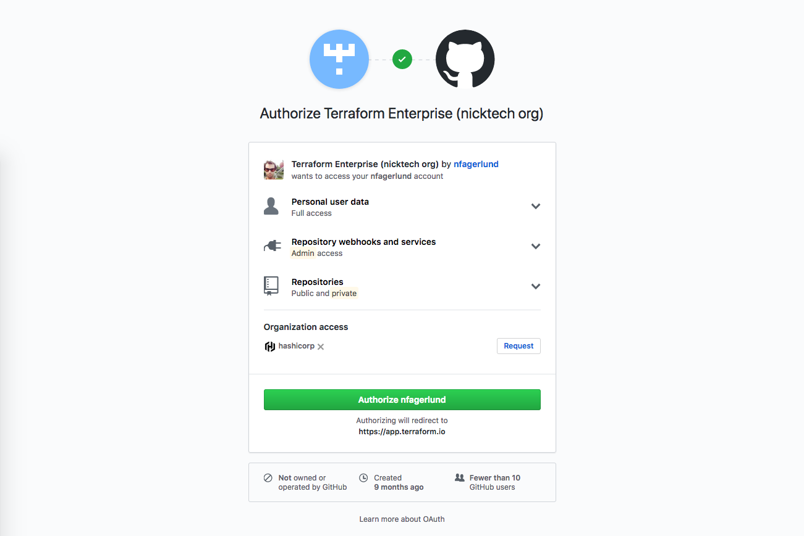

# Configuring GitHub.com Access (OAuth)

These instructions are for using GitHub.com for Terraform Cloud's VCS features, using a per-organization OAuth connection with the permissions of one particular GitHub user. For beginning users on Terraform Cloud, we recommend using our [configuration-free GitHub App](./github-app.html) to access repositories instead.

[GitHub Enterprise has separate instructions,](./github-enterprise.html) as do the [other supported VCS providers.](./index.html)

Connecting Terraform Cloud to your VCS involves five steps:

On your VCS | On Terraform Cloud
--|--
Register your Terraform Cloud organization as a new app. Get ID and key. | &nbsp;
&nbsp; | Tell Terraform Cloud how to reach VCS, and provide ID and key. Get callback URL.
Provide callback URL. | &nbsp;
&nbsp; | Request VCS access.
Approve access request. | &nbsp;

The rest of this page explains the GitHub versions of these steps.

-> **Note:** Alternately, you can skip the OAuth configuration process and authenticate with a personal access token. This requires using Terraform Cloud's API. For details, see [the OAuth Clients API page](../api/oauth-clients.html).

## Step 1: On Terraform Cloud, Begin adding VCS Provider

1. Open Terraform Cloud in your browser and navigate to the "VCS Provider" settings for your organization. Click the "Add VCS Provider" button.

    If you just created your organization, you might already be on this page. Otherwise:

    1. Click the upper-left organization menu, making sure it currently shows your organization.
    1. Click the "Settings" link at the top of the page (or within the &#9776; menu)
    1. On the next page, click "VCS Provider" in the left sidebar.
    1. Click the "Add VCS Provider" button.

2. The next page has several steps to guide you through adding a new VCS provider. Select "GitHub" then select "GitHub (Custom)" from the dropdown.

## Step 2: On GitHub, Create a New OAuth Application

1. Open [github.com](https://github.com) in your browser and log in as whichever account you want Terraform Cloud to act as. For most organizations this should be a dedicated service user, but a personal account will also work.

    ~> **Important:** The account you use for connecting Terraform Cloud **must have admin access** to any shared repositories of Terraform configurations, since creating webhooks requires admin permissions.

2. Navigate to GitHub's [Register a New OAuth Application](https://github.com/settings/applications/new) page.

    This page is located at <https://github.com/settings/applications/new>. You can also reach it through GitHub's menus:
    - In the upper right corner, click your profile picture and choose "Settings."
    - In the navigation sidebar, click "Developer settings," then make sure you're on the "OAuth Apps" page (not "GitHub Apps").
    - In the upper right corner, click the "New OAuth App" button.

3. This page has a form with four text fields.

    

    Fill them in as follows:

    Field name                 | Value
    ---------------------------|--------------------------------------------------
    Application Name           | Terraform Cloud (`<YOUR ORGANIZATION NAME>`)
    Homepage URL               | `https://app.terraform.io` (or the URL of your Terraform Enterprise instance)
    Application Description    | Any description of your choice.
    Authorization callback URL | `https://app.terraform.io/<YOUR CALLBACK URL>`

4. Click the "Register application" button, which creates the application and takes you to its page.

5. <a href="./images/tfe_logo.png" download>Download this image of the Terraform logo</a>, upload it with the "Upload new logo" button or the drag-and-drop target, and set the badge background color to `#5C4EE5`. This optional step helps you identify Terraform Cloud's pull request checks at a glance.

6. Leave this page open in a browser tab. In the next step, you will copy and paste the unique **Client ID** and **Client Secret.**

    

## Step 3: On Terraform Cloud, Set up Your Provider

1. Enter the **Client ID** and **Client Secret** from the previous step, as well as an optional **Name** for this VCS connection.

    

3. Click "Connect and continue." This takes you to a page on GitHub.com, asking whether you want to authorize the app.

4. The authorization page lists any GitHub organizations this account belongs to. If there is a "Request" button next to the organization that owns your Terraform code repositories, click it now. Note that you need to do this even if you are only connecting workspaces to private forks of repositories in those organizations since those forks are subject to the organization's access restrictions.  See [About OAuth App access restrictions](https://help.github.com/articles/about-oauth-app-access-restrictions).

    

5. Click the green "Authorize `<GITHUB USER>`" button at the bottom of the authorization page. GitHub might request your password to confirm the operation.

## Step 4: On Terraform Cloud, Set Up SSH keypair (optional)

-> **Note:** Most organizations will not need to add an SSH private key. However, if the organization repositories include Git submodules that can only be accessed via SSH, an SSH key can be added along with the OAuth credentials. You can add or update the SSH private key at a later time.

1. If you don't need an SSH keypair click the "Skip and Finish" button.

2. If you do need an SSH keypair, create an SSH keypair on a secure workstation that Terraform Cloud can use to connect to GitHub.com. The exact command depends on your OS, but is usually something like:

`ssh-keygen -t rsa -m PEM -f "/Users/<NAME>/.ssh/service_terraform" -C "service_terraform_enterprise"`

This creates a `service_terraform` file with the private key, and a `service_terraform.pub` file with the public key. This SSH key **must have an empty passphrase**. Terraform Cloud cannot use SSH keys that require a passphrase.

3. Logged into the GitHub.com account you want Terraform Cloud to act as, navigate to the SSH Keys settings page, add a new SSH key and paste the value of the SSH public key you just created.

4. Paste the text of the **SSH private key** you created in step 2, and click the "Add SSH Key" button.

    

### Important Notes

- Do not use your personal SSH key to connect Terraform Cloud and Bitbucket Server; generate a new one or use an existing key reserved for service access.
- In the following steps, you must provide Terraform Cloud with the private key. Although Terraform Cloud does not display the text of the key to users after it is entered, it retains it and will use it for authenticating to Bitbucket Server.
- **Protect this private key carefully.** It can push code to the repositories you use to manage your infrastructure. Take note of your organization's policies for protecting important credentials and be sure to follow them.

## Step 5: Contact Your GitHub Organization Admins

If your organization uses OAuth app access restrictions, you had to click a "Request" button when authorizing Terraform Cloud, which sent an automated email to the administrators of your GitHub organization. An administrator must approve the request before Terraform Cloud can access your organization's shared repositories.

If you're a GitHub administrator, check your email now and respond to the request; otherwise, contact whoever is responsible for GitHub accounts in your organization, and wait for confirmation that they've approved your request.

## Finished

At this point, GitHub access for Terraform Cloud is fully configured, and you can create Terraform workspaces based on your organization's shared GitHub repositories.
