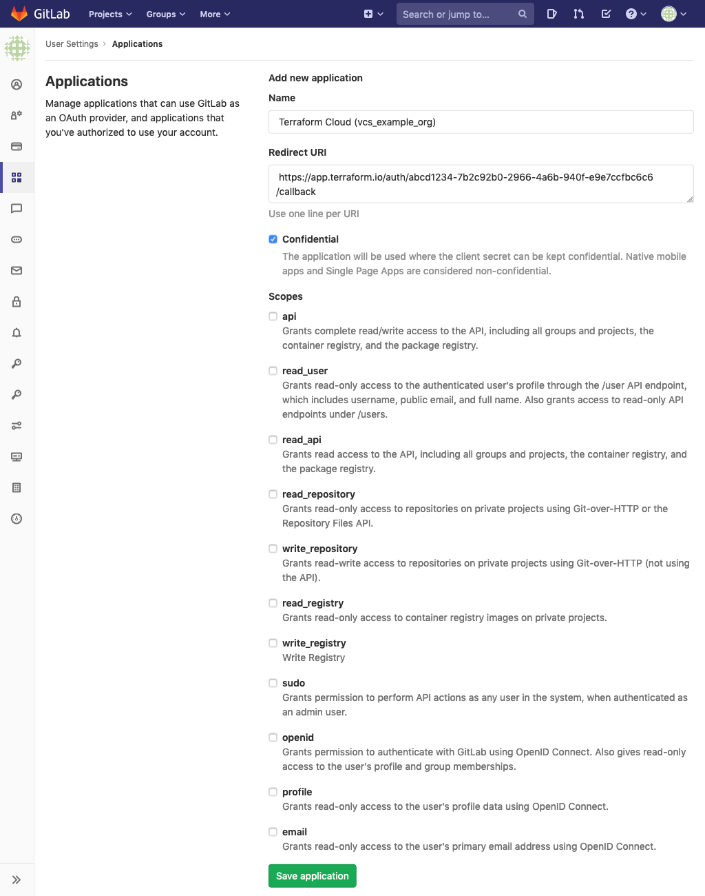
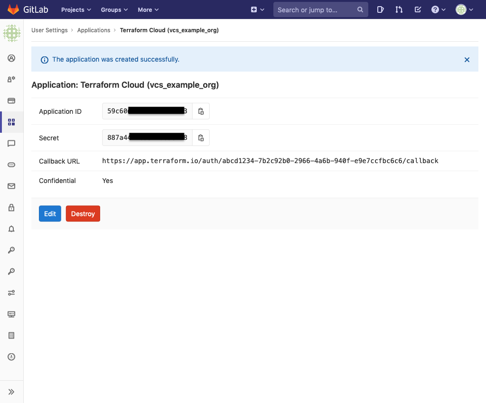
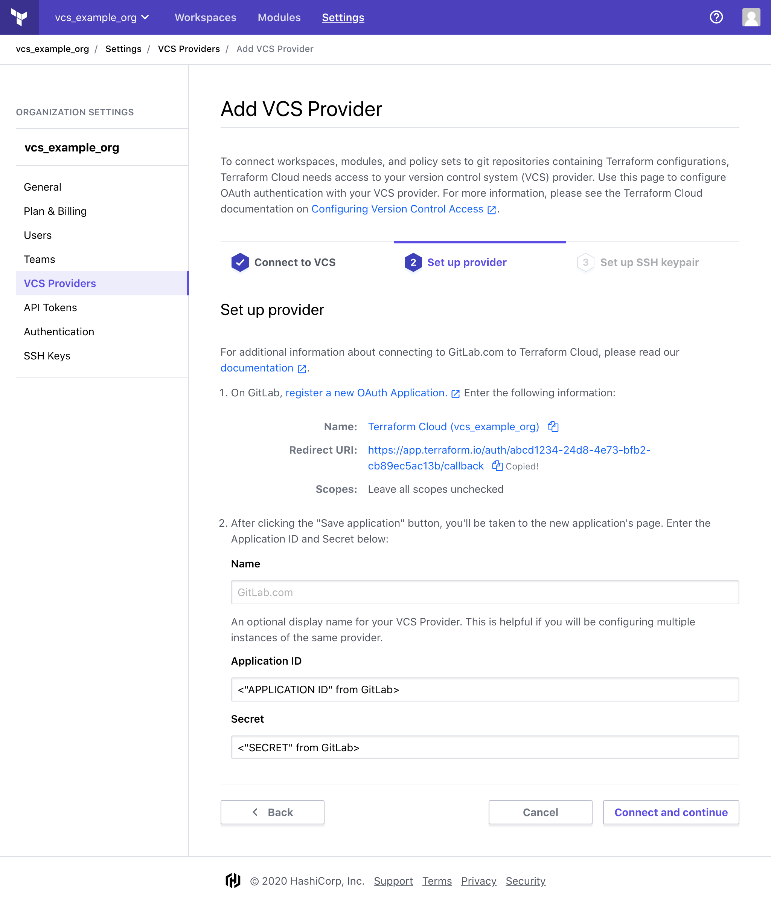
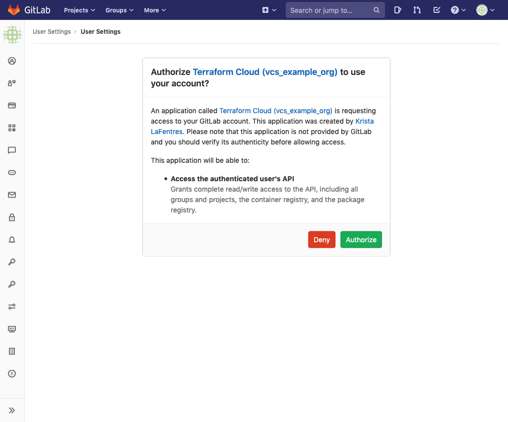

# Configuring GitLab.com Access

These instructions are for using GitLab.com for Terraform Cloud's VCS features. [GitLab CE and GitLab EE have separate instructions,](./gitlab-eece.html) as do the [other supported VCS providers.](./index.html)

Connecting Terraform Cloud to your VCS involves four steps:

On your VCS                                                                    | On Terraform Cloud
--                                                                             |--
&nbsp;                                                                         | Create a new connection in Terraform Cloud. Get redirect URI.
Register your Terraform Cloud organization as a new app. Provide redirect URI. | &nbsp;
&nbsp;                                                                         | Provide Terraform Cloud with application ID and secret. Request VCS access.
Approve access request.                                                        | &nbsp;

The rest of this page explains the GitLab.com versions of these steps.

-> **Note:** Alternately, you can skip the OAuth configuration process and authenticate with a personal access token. This requires using Terraform Cloud's API. For details, see [the OAuth Clients API page](../api/oauth-clients.html).

## Step 1: On Terraform Cloud, Begin Adding a VCS Provider

1. Open Terraform Cloud in your browser and navigate to the Settings > VCS Providers page for your organization. Click the "Add VCS Provider" button.

    If you just created your organization, you might already be on this page. Otherwise:

    1. Click the upper-left organization menu, making sure it currently shows your organization.
    1. Click the "Settings" link at the top of the page (or within the &#9776; menu)
    1. On the next page, click "VCS Provider" in the left sidebar.
    1. Click the "Add VCS Provider" button.

2. The next page has several steps to guide you through adding a new VCS provider. Select "GitLab" then select "GitLab.com" from the dropdown.

4. Locate the "Redirect URI," and copy it to your clipboard; you'll paste it in the next step. Leave this page open in a browser tab.

    
    
## Step 2: On GitLab, Create a New Application

1. Open [gitlab.com](https://gitlab.com) in your browser and log in as whichever account you want Terraform Cloud to act as. For most organizations this should be a dedicated service user, but a personal account will also work.

    ~> **Important:** The account you use for connecting Terraform Cloud **must have admin (master) access** to any shared repositories of Terraform configurations, since creating webhooks requires admin permissions.

2. Navigate to GitLab's [User Settings > Applications](https://gitlab.com/profile/applications) page.

    This page is located at <https://gitlab.com/profile/applications>. You can also reach it through GitLab's menus:
    - In the upper right corner, click your profile picture and choose "Settings."
    - In the navigation sidebar, click "Applications."

3. This page has a list of applications and a form for adding new ones. The form has two text fields and some checkboxes.

    

    Fill out the form as follows:

    Field                   | Value
    ------------------------|--------------------------------------------------
    Name                    | Terraform Cloud (`<YOUR ORGANIZATION NAME>`)
    Redirect URI            |`https://app.terraform.io/<YOUR CALLBACK URL>`, the redirect URI you copied from Terraform Cloud
    Confidential (checkbox) | ✔️ (enabled)
    Scopes (all checkboxes) | (empty)

4. Click the "Save application" button, which creates the application and takes you to its page.

5. Leave this page open in a browser tab. In the next step, you will copy and paste the unique **Application ID** and **Secret.**

    

## Step 3: On Terraform Cloud, Set up Your Provider

1. Enter the **Application ID** and **Secret** from the previous step, as well as an option **Name** for this VCS connection.

    

2. Click "Connect and continue." This takes you to a page on GitLab.com, asking whether you want to authorize the app.
                                 
    
    
3. Click the green "Authorize" button at the bottom of the authorization page. 

## Step 4: On Terraform Cloud, Set Up SSH keypair (optional)

-> **Note:** Most organizations will not need to add an SSH private key. However, if the organization repositories include Git submodules that can only be accessed via SSH, an SSH key can be added along with the OAuth credentials. You can add or update the SSH private key at a later time.

### Important Notes

- Do not use your personal SSH key to connect Terraform Cloud and GitLab; generate a new one or use an existing key reserved for service access.
- In the following steps, you must provide Terraform Cloud with the private key. Although Terraform Cloud does not display the text of the key to users after it is entered, it retains it and will use it for authenticating to GitLab.
- **Protect this private key carefully.** It can push code to the repositories you use to manage your infrastructure. Take note of your organization's policies for protecting important credentials and be sure to follow them.

### If you don't need an SSH keypair:

1. Click the "Skip and Finish" button. This returns you to Terraform Cloud's VCS Provider page, which now includes your new GitLab client.

### If you do need an SSH keypair:

1. Create an SSH keypair on a secure workstation that Terraform Cloud can use to connect to GitLab.com. The exact command depends on your OS, but is usually something like:
   `ssh-keygen -t rsa -m PEM -f "/Users/<NAME>/.ssh/service_terraform" -C "service_terraform_enterprise"`
   This creates a `service_terraform` file with the private key, and a `service_terraform.pub` file with the public key. This SSH key **must have an empty passphrase**. Terraform Cloud cannot use SSH keys that require a passphrase.

2. Logged into the GitLab.com account you want Terraform Cloud to act as, navigate to the SSH Keys settings page, add a new SSH key and paste the value of the SSH public key you just created.

3. Paste the text of the **SSH private key** you created in step 2, and click the "Add SSH Key" button. This returns you to Terraform Cloud's VCS Provider page, which now includes your new GitLab client.

    
    
## Finished

At this point, GitLab.com access for Terraform Cloud is fully configured, and you can create Terraform workspaces based on your organization's shared repositories.

