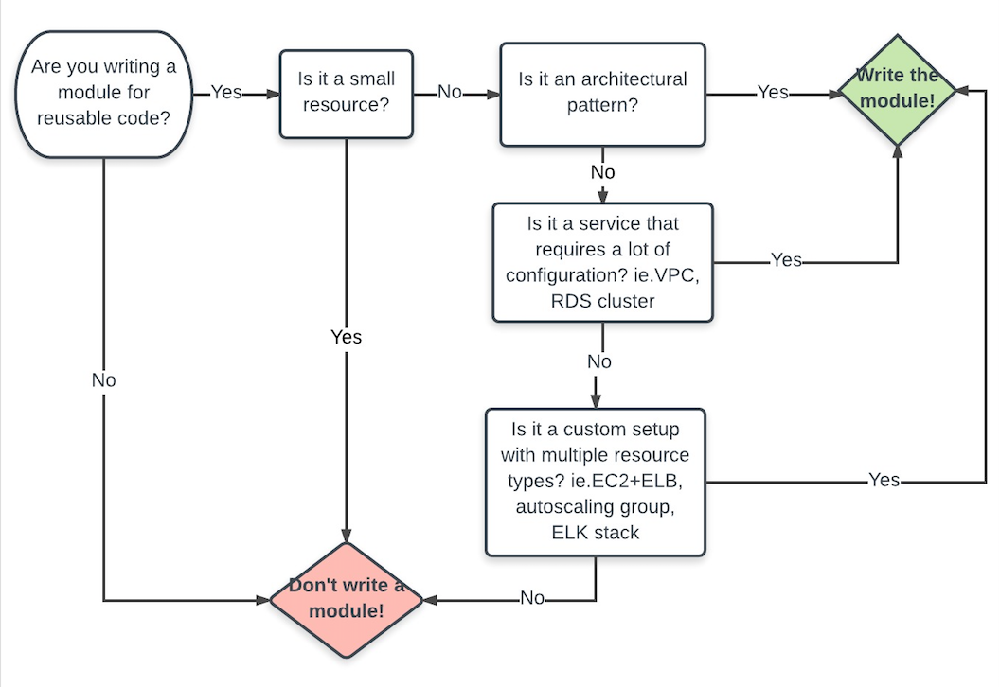

# Part 3.2: How to Move from Semi-Automation to Infrastructure as Code

We define semi-automated provisioning as a mix of at least two of the following practices:

* Infrastructure as code with Terraform.
* Manual CLI or GUI processes.
* Scripts.

If that describes your current provisioning practices, your next goal is to expand your use of Terraform, reduce your use of manual processes and imperative scripts, and make sure you’ve adopted the foundational practices that make infrastructure as code more consistent and useful.

Note: If you aren’t already using infrastructure as code for some portion of your infrastructure, make sure you follow the steps in the previous section first.

## 1. Use Version Control

Choose and implement a version control system (VCS) if your organization doesn’t already use a VCS.

You might be able to get by with a minimalist Git/Mercurial/SVN server, but we recommend adopting a more robust collaborative VCS application that supports code reviews/approvals and has APIs for accessing data and administering repositories and accounts. Bitbucket, GitLab, and GitHub are popular tools in this space.

If you already have established VCS workflows, layouts, and access control practices, great! If not, this is a good time to make these decisions. (We consider [this advice](https://www.drupalwatchdog.com/volume-4/issue-2/version-control-workflow-strategies) to be a good starting point.) Make sure you have a plan for who is allowed to merge changes and under what circumstances — since this code will be managing your whole infrastructure, it’s important to maintain its integrity and quality.

Also, make sure to write down your organization’s expectations and socialize them widely among your teams.

Make sure you've picked a VCS system that Terraform Enterprise will be able to access. Currently, Terraform Enterprise supports integrations with GitHub, GitLab and Atlassian Bitbucket (both Server and Cloud).

## 2. Put Terraform Code in VCS Repos

Start moving infrastructure code into version control. New Terraform code should all be going into version control; if you have existing Terraform code that’s outside version control, start moving it in so that everyone in your organization knows where to look for things and can track the history and purpose of changes.

## 3. Create Your First Module

[Terraform](https://www.terraform.io/docs/modules/usage.html) [modules](https://www.terraform.io/docs/modules/usage.html) are reusable configuration units. They let you manage pieces of infrastructure as a single package you can call and define multiple times in the main configuration for a workspace. Examples of a good Terraform module candidate would be an auto-scaling group on AWS that wraps a launch configuration, auto-scaling group, and EC2 Elastic Load Balancer (ELB). If you are already using Terraform modules, make sure you’re following the best practices and keep an eye on places where your modules could improve.

The diagram below can help you decide when to write a module:

## 4. Share Knowledge

Spread Terraform skills to additional teams, and improve the skills of existing infrastructure teams. In addition to internal training and self-directed learning, you might want to consider:

* Sign your teams up for [official HashiCorp Training](https://www.hashicorp.com/training/) .
* Make available resources such as [Terraform Up and Running: Writing Infrastructure as Code](https://www.amazon.com/Terraform-Running-Writing-Infrastructure-Code-ebook/dp/B06XKHGJHP/ref=sr_1_1?ie=UTF8&qid=1496138592&sr=8-1&keywords=terraform+up+and+running) or [Getting Started with Terraform](https://www.amazon.com/Getting-Started-Terraform-Kirill-Shirinkin/dp/1786465108/ref=sr_1_1?ie=UTF8&qid=1496138892&sr=8-1&keywords=Getting+Started+with+Terraform). These are especially valuable when nobody in your organization has used Terraform before.

## 5. Set Guidelines

Create standard build architectures to use as guidelines for writing Terraform code. Modules work best when they’re shared across an organization, and sharing is more effective if everyone has similar expectations around how to design infrastructure. Your IT architects should design some standardized build architectures specific to your organizational needs, to encourage building with high availability, elasticity and disaster recovery in mind, and to support consistency across teams.

Here are a few examples of good build patterns from several cloud providers:

* AWS: [Well Architected Frameworks](https://d0.awsstatic.com/whitepapers/architecture/AWS_Well-Architected_Framework.pdf) and the [Architecture Center](https://aws.amazon.com/architecture/).
* Azure: [deploying Azure Reference Architectures](https://github.com/mspnp/reference-architectures) and [Azure Architecture Center](https://docs.microsoft.com/en-us/azure/architecture/).
* GCP: [Building scalable and resilient web applications.](https://cloud.google.com/solutions/scalable-and-resilient-apps)
* Oracle Public Cloud: [Best Practices for Using Oracle Cloud.](https://docs.oracle.com/cloud/latest/stcomputecs/STCSG/GUID-C37FDFF1-7C48-4DA8-B31F-D7D7B35674A8.htm#STCSG-GUID-C37FDFF1-7C48-4DA8-B31F-D7D7B35674A8)

## 6. Integrate Terraform With Configuration Management

If your organization already has a configuration management tool, then it’s time to integrate it with Terraform — you can use [Terraform’s provisioners](https://www.terraform.io/docs/provisioners/index.html) to pass control to configuration management after a resource is created. Terraform should handle the infrastructure, and other tools should handle user data and applications.

If you don’t use configuration management, and you aren’t using strictly immutable infrastructure, you should consider adopting a config management tool. This might be a large task, but it supports the same goals that drove you to infrastructure as code, by making application configuration more controllable, understandable, and repeatable across teams.

If you’re just getting started, try this tutorial on how to [create a Chef cookbook](https://www.vagrantup.com/docs/provisioning/chef_solo.html) and test it locally with Vagrant. We also recommend this article about how to decide what [configuration management tool](http://www.intigua.com/blog/puppet-vs.-chef-vs.-ansible-vs.-saltstack) is best suited for your organization.

## 7. Manage Secrets

Integrate Terraform with [Vault](https://www.terraform.io/docs/providers/vault/index.html) or another secret management tool. Secrets like service provider credentials must stay secret, but they also must be easy to use when needed. The best way to address those needs is to use a dedicated secret management tool. We believe HashiCorp’s Vault is the best choice for most people, but Terraform can integrate with other secret management tools as well.

## Next

At this point, your organization has a VCS configured, is managing key infrastructure with Terraform, and has at least one reusable Terraform module. Compared to a semi-automated practice, your organization has much better visibility into infrastructure configuration, using a consistent language and workflow.

Next, you need an advanced workflow that can scale and delegate responsibilities to many contributors. Continue on to [Part 3.3: How to Move from Infrastructure as Code to Collaborative Infrastructure as Code](./part3.3.html).
