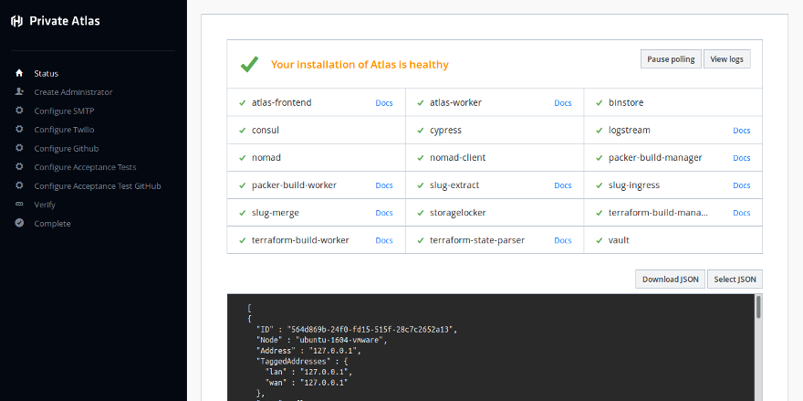
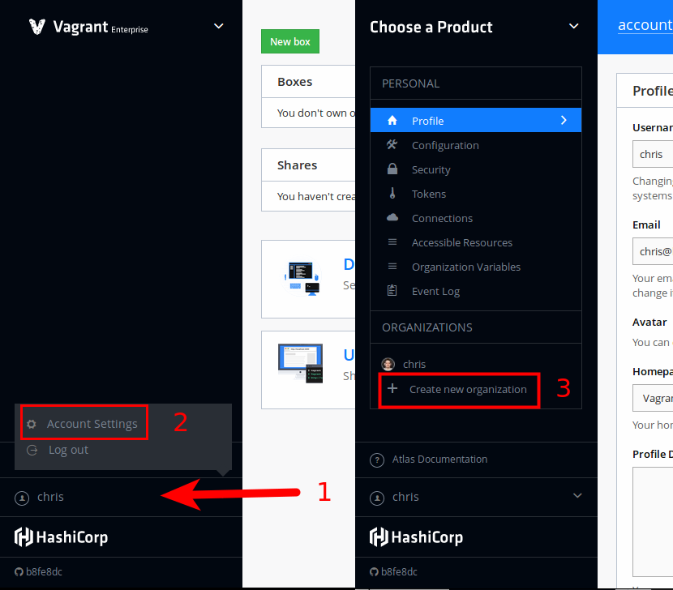
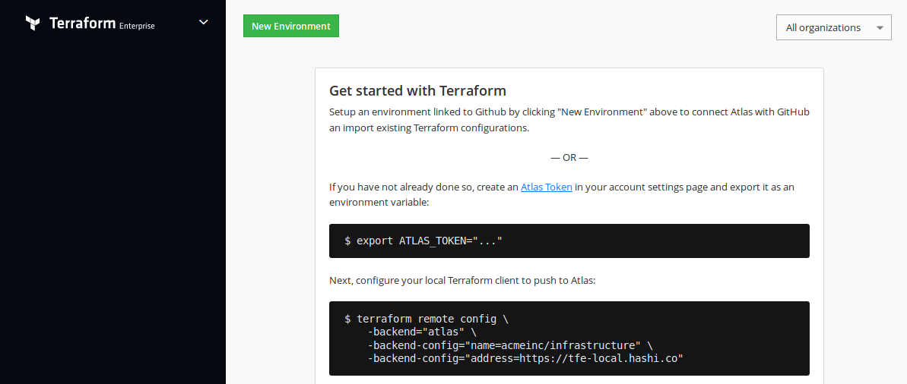
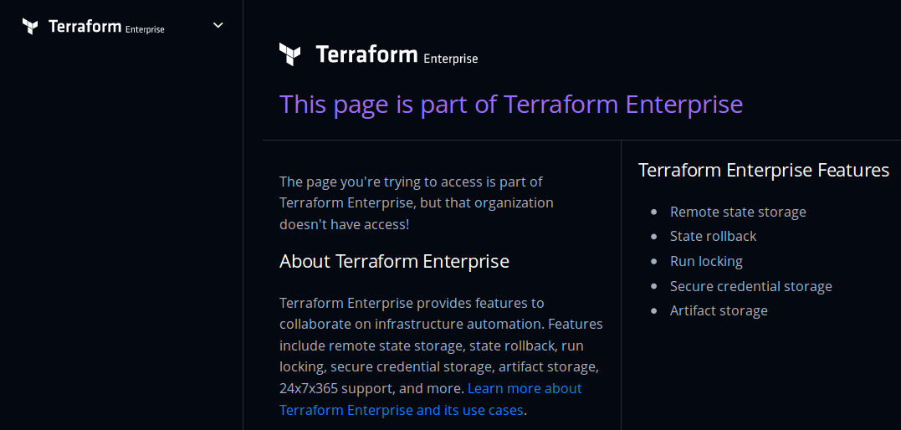

# Private Terraform Enterprise Configuration

After you have completed the installation process you will need to create an
administrator account, configure your Private Terraform Enterprise installation so
it can send emails and SMS, and connect to your git hosting provider.

When the system configuration has been completed you will proceed with team
setup by creating your first organizations and users, and enabling the
enterprise features for those accounts.

**Note:** If you are performing an upgrade or restore for an existing
installation you _do not_ need to follow these steps. If your upgraded or
restored installation does not function without the steps below then it was not
correctly restored from backup. Please contact HashiCorp for help.

Here is a rough overview of what we will cover in these sections:

1. [System Configuration](/docs/enterprise-beta/private/config.html#system-configuration)
	1. [Create the administrator account](/docs/enterprise-beta/private/config.html#creating-an-administrator)
	2. [Configure SMTP for sending emails](/docs/enterprise-beta/private/config.html#configure-smtp)
	3. [Configure Twilio for sending SMS messages](/docs/enterprise-beta/private/config.html#configure-twilio)
	4. [Configure connectivity to git](/docs/enterprise-beta/private/config.html#configure-git-hub-)
	5. [Configure acceptance tests](/docs/enterprise-beta/private/config.html#configure-acceptance-tests-verify-and-complete)
2. [Team Setup](/docs/enterprise-beta/private/config.html#team-setup)
	1. [Inviting Colleagues](/docs/enterprise-beta/private/config.html#inviting-colleagues)
	2. [Creating an Organization](/docs/enterprise-beta/private/config.html#creating-an-organization)
	3. [Creating a Team](/docs/enterprise-beta/private/config.html#creating-a-team)
	4. [Enabling Enterprise Features](/docs/enterprise-beta/private/config.html#enabling-enterprise-features)
	5. [Accessing Terraform and Packer Features](/docs/enterprise-beta/private/config.html#accessing-terraform-and-packer-features)
	6. [Creating Additional Administrators](/docs/enterprise-beta/private/config.html#creating-additional-administrators)

## System Configuration

Navigate to <https://tfe.example.com/admin/bootstrap> in your browser. You will
be presented with a status page that looks like this:

Along the left side you will notice a list of items including `Create
Administrator` and several `Configure ...`. These will help you navigate between
the subsequent steps, or to skip ahead. If at any point you get lost you can
return to <https://tfe.example.com/admin/bootstrap> to pick up where you left
off.

**Note:** Please substitute the hostname for your Private Terraform Enterprise installation in place of
`tfe.example.com`.

### Creating an Administrator

First, click on `Create Administrator` and create an administrator account. You
will be able to create additional administrators later.

After clicking `Save and Continue` you will be prompted to login with the
account credentials you just created. Do so and you will be returned to the
`Configure SMTP` step.

### Configure SMTP

Terraform Enterprise sends emails occasionally for features like password reset and to alert you
when a new administrator is added. Fill out the details for your SMTP server.
You may use an external provider such as Amazon SES or Mailgun.

When you have added your configuration press `Save and Continue`, or skip to the
next step.

### Configure Twilio

Terraform Enterprise uses Twilio to send SMS if a user selects SMS as their multi-factor
authentication option. If Twilio is not configured they must use the Google
Authenticator app on their smartphone instead.

When you have added your configuration press `Save and Continue`, or skip to the
next step.

### Configure Git(Hub)

To use most Private Terraform Enterprise features you will need to configure it to ingest data from git.
This step is titled `Configure GitHub`, and the example steps assume GitHub, but
you can select other git providers such as GitLab or Bitbucket from the dropdown.

1. Fill in HTTP URL and API URL in Terraform Enterprise for your git provider

	> Note to users of github.com - due to a bug in GitHub's OAuth
	authentication, the HTTP URL must be set to https://github.com. This differs
	from the example text, which includes a www.

2. Create a new OAuth application in GitHub (for example,
	<https://github.com/settings/applications/new>)

3. Fill out the Homepage URL in GitHub to match your Private Terraform Enterprise URL

4. Leave the Authorization callback URL on GitHub **blank** and click `Create
	Application`

5. Copy the Client ID and Client Secret from GitHub into the corresponding Terraform Enterprise
	fields.

6. Click `Save and Continue`.

7. Copy the new callback URL from Terraform Enterprise into GitHub. (For example:
	<https://tfe.example.com/auth/[uuid]/callback>) and click `Update
	application` in GitHub.

8. Click `Connect` and follow the GitHub OAuth flow.

9. When you see "Successfully linked to GitHub" click `Logged in with GitHub` to
	proceed to the next step.

If you need to change a setting, click `Reconfigure` at the bottom of the page.
If you have already completed this step or navigated away from the page, you can
edit the OAuth configuration by way of the `here` link in the yellow bar at the
top of the `Configure GitHub` page.

### Configure Acceptance Tests, Verify, and Complete

The `Configure Acceptance Tests`, `Configure Acceptance Test GitHub`, `Verify`,
and `Complete` steps are no longer used and will be removed in a future version
of Private Terraform Enterprise.

After configuring your git provider, you are finished with the System
Configuration section and should move on to Team Setup.

## Team Setup

Private Terraform Enterprise models Packer and Terraform projects as Builds and Environments,
respectively.

Private Terraform Enterprise models user access via Organizations, Teams, and Users. An organization
contains one or more teams, and a team contains one or more users. Additionally,
each user has a corresponding organization that can be used to share personal
projects with other users.

Enterprise features such as Terraform and Packer are enabled at the organization
level. Visibility and access controls to Packer Builds and Terraform
Environments can be made at the Organization, Team, or individual user levels.

Below, we will cover inviting users, creating an organization, and adding
permissions.

### Inviting Colleagues

You must invite your colleagues to create Terraform accounts by sharing the signup URL
for your Private Terraform Enterprise installaton. They must complete the signup process before you can
add them to teams or grant them additional privileges. Send this URL to your
colleagues and have them sign up <https://tfe.example.com/account/new>.

Remember to replace `tfe.example.com` with your Private Terraform Enterprise hostname.

### Creating an Organization

Create an organization by navigating to the Private Terraform Enterprise homepage. You will need to login
if you have not already done so. Then, click your username in the bottom left,
and click `Account Settings`. On the following page, click `Create Organization`
on the left menu.

You can jump to this page via <https://tfe.example.com/organizations/new>.

You will need to fill in a name and email for the organization.

To return to the organization page at a later time, follow the same flow through
the UI. Click your username, click `Account Settings`, and then click the
organization in the left menu.

You will notice that you also have an organization matching your username. This
allows you to share projects owned by your personal account (rather than an
organization) with other users. You cannot create teams under your personal
organization.

### Creating a Team

After creating an organization in the previous step, choose `Teams` from the
left menu. Type in a name for the team and then click `Create Team`. Next, click
`Manage` next to the new team to add members by typing their names into the
`Username` box. If no one else has joined yet you can add yourself.

Teams are primarily used to assign read or read/write access controls to various
projects inside an organization. Each organization has an "Owners" team that has
full access to projects in that organization.

### Enabling Enterprise Features

By default organizations do not have enterprise features enabled. You will need
to turn these on in order to use Terraform and Packer features in your Terraform
installation.

Navigate to <https://tfe.example.com/admin/organization> in your browser. Since
this is part of the admin interface there is no way to navigate here organically
and you will need to remember this URL.

From the Organizations admin page click the `edit` link next to your
organization, then scroll to the bottom of the page. Check the `Terraform` and
`Packer` check boxes under `Enterprise billing active?`, and then click `Update
Organization`.

### Accessing Terraform and Packer Features

Finally, you will be able to access Terraform and Packer features by selecting
them from the dropdown in the top left (which shows Vagrant by default). You
should see the following page:

You are now ready to use Terraform Enterprise!

If you see this page instead, you must follow the directions under **Enabling
Enterprise Features**, above:

If you have trouble getting past this page, please reach out to HashiCorp for
help.

### Creating Additional Administrators

Navigate to <https://tfe.example.com/admin/user> in your browser. Since
this is part of the admin interface there is no way to navigate here organically
and you will need to remember this URL.

Here you can search for and select a user to promote to administrator. Click
`edit` and then click the `Grant Admin Privileges` button.

Please note that administrators are superusers and are intended to assist with
Terraform maintenance, account rescue, and troubleshooting. Normal users should never
need admin privileges and you should audit access to admin accounts, since they
can bypass user security controls such as MFA, impersonate other users, and read
secrets stored in any project.

## Known Issues

The setup process has some extra steps and UI components. HashiCorp is currently
working to improve this and these procedures will be streamlined in a future
release. Please direct any feedback in this area to HashiCorp support.
