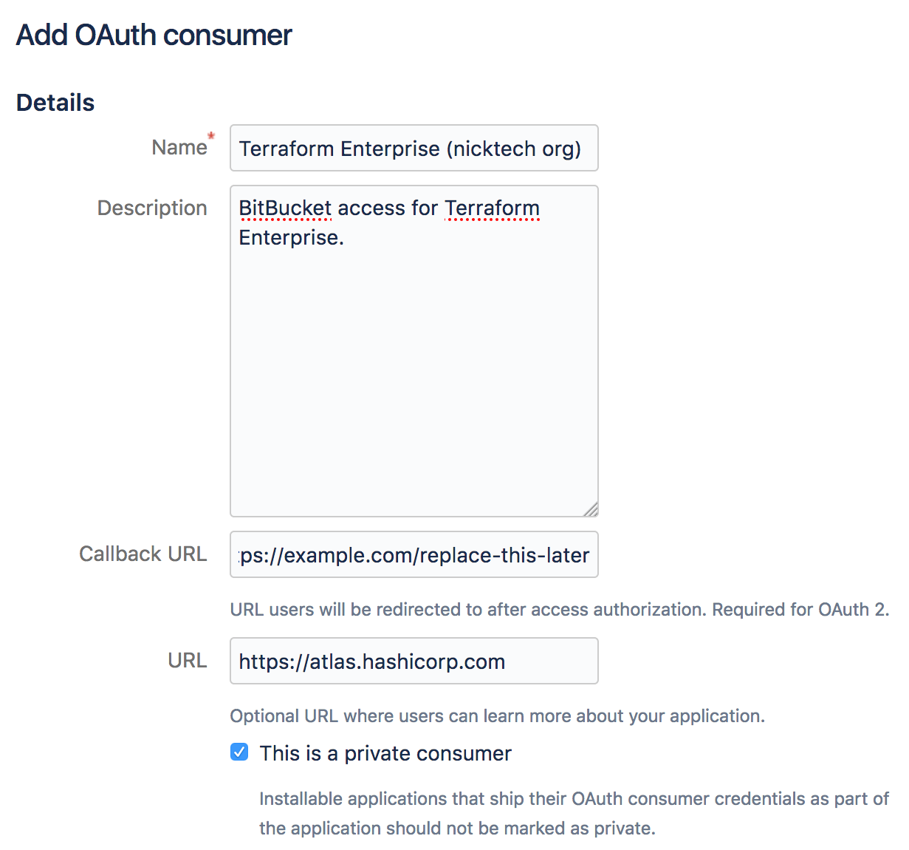
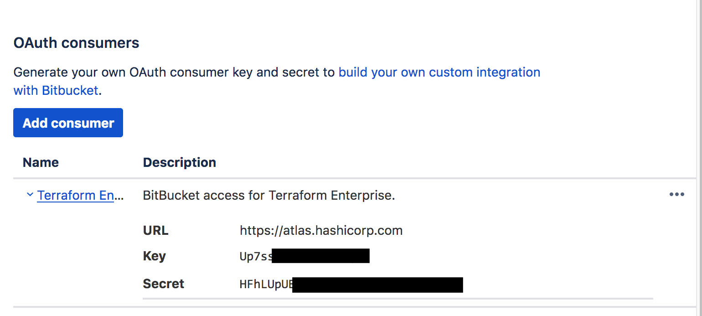
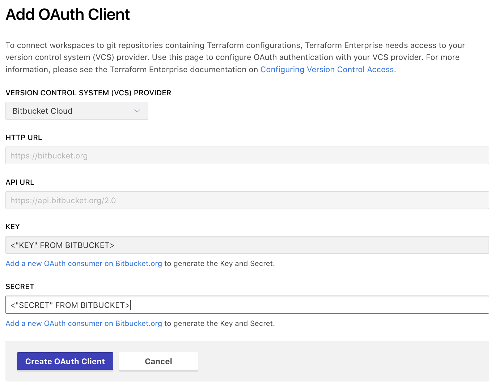
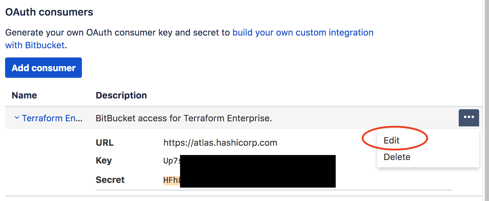
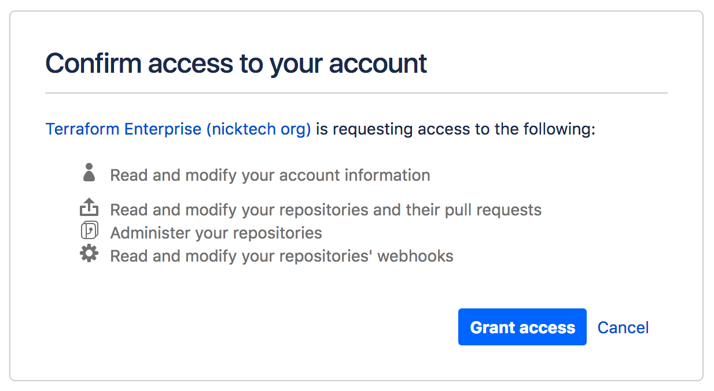

# Configuring Bitbucket Cloud Access

These instructions are for using Bitbucket Cloud for Terraform Enterprise (TFE)'s VCS features. Bitbucket Cloud is the cloud-hosted version of Bitbucket; [self-hosted Bitbucket Server instances have separate instructions,](./bitbucket-server.html) as do the [other supported VCS services.](./index.html)

Connecting TFE to your VCS involves five steps:

On your VCS | On TFE
--|--
Register your TFE organization as a new app. Get ID and key. | &nbsp;
&nbsp; | Tell TFE how to reach VCS, and provide ID and key. Get callback URL.
Provide callback URL. | &nbsp;
&nbsp; | Request VCS access.
Approve access request. | &nbsp;

The rest of this page explains the Bitbucket Cloud-specific versions of these steps.

## Step 1: On Bitbucket Cloud, Create a New OAuth Consumer

1. Open [Bitbucket Cloud](https://bitbucket.org) in your browser and log in as whichever account owns your organization's most important configuration.

    ~> **Important:** The account you use for connecting TFE and Bitbucket **must have admin access** to any team-owned repositories that conatain Terraform configurations.

    For most organizations this should be a service user, whose credentials are shared among an operations team. If you don't have an account like that, use your own account and make a note of it in your team's shared infrastructure documentation, so your colleagues know who owns this configuration.

2. Navigate to Bitbucket's "Add OAuth Consumer" page.

    This page is located at `https://bitbucket.org/account/user/<YOUR USERNAME>/oauth-consumers/new`. You can also reach it through Bitbucket's's menus:
    - In the lower left corner, click your profile picture and choose "Bitbucket settings."
    - In the settings navigation, click "OAuth," which is in the "Access Management" section.
    - On the OAuth settings page, click the "Add consumer" button.

3. This page has a form with four text fields and many checkboxes.

    

    

    Fill out the text fields as follows:

    Field            | Value
    -----------------|--------------------------------------------------
    Name             | Terraform Enterprise (`<YOUR ORGANIZATION NAME>`)
    Description      | Any description of your choice.
    Callback URL     | `https://example.com/replace-this-later` (or any placeholder; the correct URI doesn't exist until the next step.)
    URL              | `https://atlas.hashicorp.com` (or the URL of your private TFE install)

    Ensure that the "This is a private consumer" option is checked. Then, activate the following permissions checkboxes:

    Permission type | Permission level
    ----------------|-----------------
    Account         | Write
    Repositories    | Admin
    Pull requests   | Write
    Webhooks        | Read and write

4. Click the "Save" button, which returns you to the OAuth settings page.

5. Find your new OAuth consumer under the "OAuth Consumers" heading, and click its name to reveal its details. Take note of two items: the **Key** and the **Secret.** You'll copy and paste these unique strings in the next step. Leave this page open in a browser tab.

    

## Step 2: On TFE, Add an OAuth Client

1. Open TFE in your browser and navigate to the "OAuth Configuration" settings for your organization. Click the "Add an OAuth Client" button.

    If you just created your organization, you might already be on this page. Otherwise:

    1. Click the upper-left organization menu, making sure it currently shows your organization.
    1. Click the "`<ORGANIZATION>` Settings" link, right below the name of your organization.
    1. On the next page, click "OAuth Configuration" in the left sidebar.
    1. Click the "Add an OAuth Client" button.

2. The next page has a drop-down and four text fields. Select "Bitbucket Cloud" from the drop-down, and enter the **Key** and **Secret** from the previous step. (Ignore the two disabled URL fields, which are used for on-premise VCSs.)

    

3. Click "Create connection." This will take you back to the OAuth Configuration page, which now includes your new Bitbucket client.

4. Locate the new client's "Callback URL," and copy it to your clipboard; you'll paste it in the next step. Leave this page open in a browser tab.

    

## Step 3: On Bitbucket Cloud, Update the Callback URL

1. Go back to your Bitbucket Cloud browser tab. (If you accidentally closed it, you can reach your OAuth settings page through the menus: use the lower left menu > Bitbucket settings > OAuth.)

2. Locate your TFE OAuth consumer. Click the elipsis ("...") button on the far right, and choose "Edit" from the menu.

    

3. In the "Callback URL" field, paste the callback URL from TFE's OAuth Configuration page, replacing the "example.com" placeholder you entered earlier.

4. Click the "Save" button. A banner saying the update succeeded should appear.

## Step 4: On TFE, Request Access

1. Go back to your TFE browser tab and click the "Connect organization `<NAME>`" button on the OAuth Configuration page.

    

    This takes you to a page on Bitbucket Cloud, asking whether you want to authorize the app.

    

2. Click the green "Authorize" button at the bottom of the authorization page. This returns you to TFE's OAuth Configuration page, where the Bitbucket Cloud client's information has been updated.

## Finished

At this point, Bitbucket Cloud access for TFE is fully configured, and you can create Terraform workspaces based on your organization's shared repositories.

