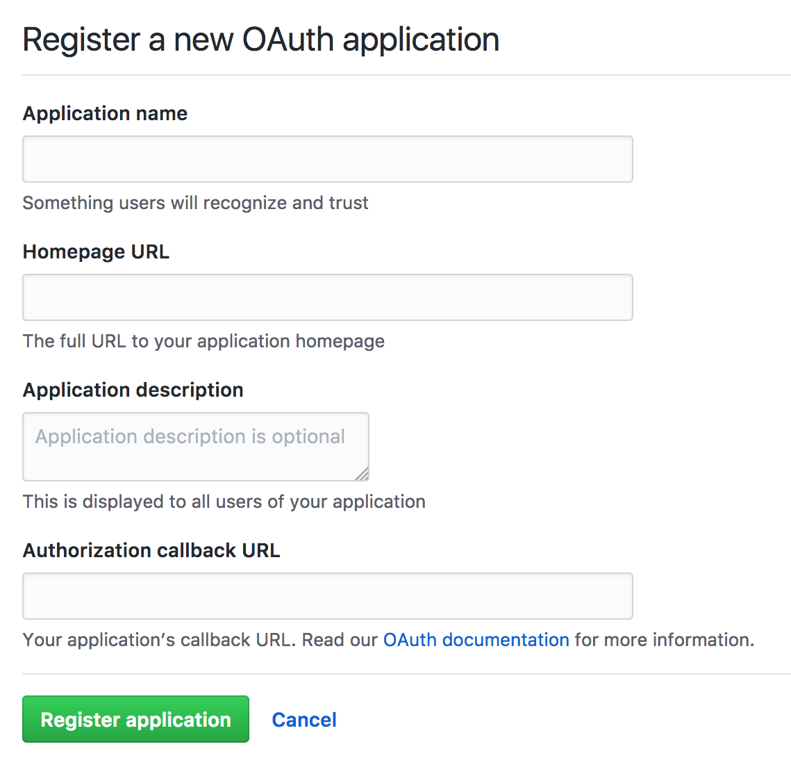

# Configuring GitHub Enterprise Access

These instructions are for using an on-premise installation of GitHub Enterprise for TFE's VCS features. [GitHub.com has separate instructions,](./github-enterprise.html) as do the [other supported VCS services.](./index.html)

Connecting TFE to your VCS involves five steps:

On your VCS | On TFE
--|--
Register your TFE organization as a new app. Get ID and key. | &nbsp;
&nbsp; | Tell TFE how to reach VCS, and provide ID and key. Get callback URL.
Provide callback URL. | &nbsp;
&nbsp; | Request VCS access.
Approve access request. | &nbsp;

The rest of this page explains the GitHub Enterprise versions of these steps.

## Step 1: On GitHub, Create a New OAuth Application

1. Open your GitHub Enterprise instance in your browser and log in as whichever account owns your organization's most important configuration.

    ~> **Important:** The account you use for connecting TFE and GitHub must be a member of your GitHub organization. It does not need full permissions on any particular repositories.

    For most organizations this should be a service user, whose credentials are shared among an operations team. If you don't have an account like that, use your own account and make a note of it in your team's shared infrastructure documentation, so your colleagues know who owns this configuration. (You can transfer ownership of the app configuration later if necessary.)

2. Navigate to GitHub's Register a New OAuth Application page.

    This page is located at `https://<GITHUB INSTANCE HOSTNAME>/settings/applications/new`. You can also reach it through GitHub's menus:

    - In the upper right corner, click your profile picture and choose "Settings."
    - In the navigation sidebar, click "OAuth Apps" (under the "Developer settings" section).
    - In the upper right corner, click the "Register a new application" button.

3. This page has a form with four text fields.

    

    Fill them in as follows:

    Field name                 | Value
    ---------------------------|--------------------------------------------------
    Application Name           | Terraform Enterprise (`<YOUR ORGANIZATION NAME>`)
    Homepage URL               | `https://atlas.hashicorp.com` (or the URL of your private TFE install)
    Application Description    | Any description of your choice.
    Authorization callback URL | `https://example.com/replace-this-later` (or any placeholder; the correct URI doesn't exist until the next step.)

4. Click the "Register application" button. This will take you to the application page.

5. Take note of two items: the **Client ID** and the **Client Secret.** You'll copy and paste these unique strings in the next step. Leave this page open in a browser tab.

    

## Step 2: On TFE, Add an OAuth Client

1. Open TFE in your browser and navigate to the "OAuth Configuration" settings for your organization. Click the "Add an OAuth Client" button.

    If you just created your organization, you might already be on this page. Otherwise:

    1. Click the upper-left organization menu, making sure it currently shows your organization.
    1. Click the "`<ORGANIZATION>` Settings" link, right below the name of your organization.
    1. On the next page, click "OAuth Configuration" in the left sidebar.
    1. Click the "Add an OAuth Client" button.

2. The next page has a drop-down and four text fields. Select "GitHub Enterprise" from the drop-down, and fill in all four text fields as follows:

    Field         | Value
    --------------|--------------------------------------------
    HTTP URL      | `https://<GITHUB INSTANCE HOSTNAME>`
    API URL       | `https://<GITHUB INSTANCE HOSTNAME>/api/v3`
    Client ID     | (paste value from previous step)
    Client Secret | (paste value from previous step)

    

3. Click "Create connection." This will take you back to the OAuth Configuration page, which now includes your new GitHub Enterprise client.

4. Locate the new client's "Callback URL," and copy it to your clipboard; you'll paste it in the next step. Leave this page open in a browser tab.

    

## Step 3: On GitHub, Update the Callback URL

1. Go back to your GitHub browser tab. (If you accidentally closed it, you can reach your OAuth app page through the menus: use the upper right menu > Settings > OAuth Apps > "Terraform Enterprise (`<YOUR ORG NAME>`)".)

2. In the "Authorization Callback URL" field, near the bottom of the page, paste the callback URL from TFE's OAuth Configuration page, replacing the "example.com" placeholder you entered earlier.

3. Click the "Update application" button. A banner saying the update succeeded should appear at the top of the page.

## Step 4: On TFE, Request Access

1. Go back to your TFE browser tab and click the "Connect organization `<NAME>`" button on the OAuth Configuration page.

    

    This takes you to a page on github.com, asking whether you want to authorize the app.

2. The authorization page lists all the GitHub organizations you belong to. Find the organization that owns your Terraform code repositories, and click its "Request" button.

    

3. Click the green "Authorize `<GITHUB USER>`" button at the bottom of the authorization page. GitHub might request your password to confirm the operation.

## Step 5: Contact Your GitHub Organization Admins

When you requested organization access for TFE, GitHub sent an automated email to the administrators of your GitHub organization. An administrator must approve the request before TFE can access your organization's shared repositories.

If you're a GitHub administrator, check your email now and respond to the request; otherwise, contact whoever is responsible for GitHub accounts in your organization, and wait for confirmation that they've approved your request.

## Finished

At this point, GitHub access for TFE is fully configured, and you can create Terraform workspaces based on your organization's shared GitHub Enterprise repositories.
