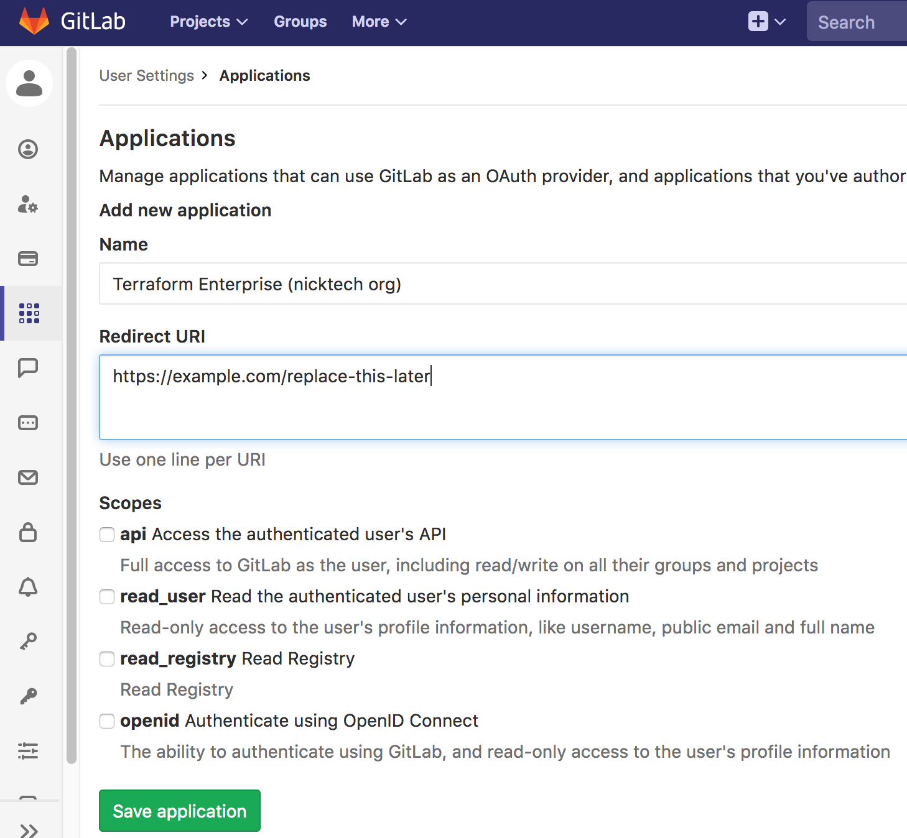
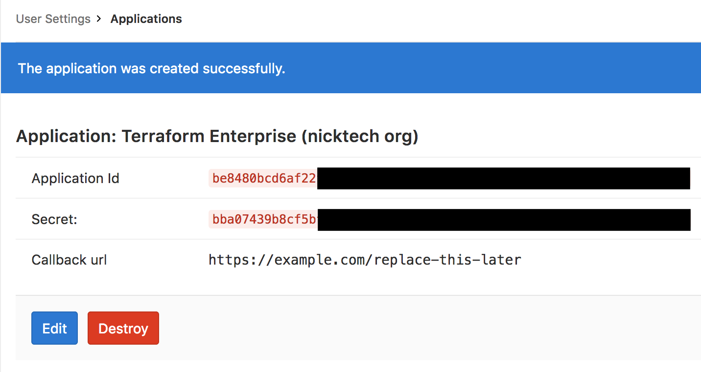
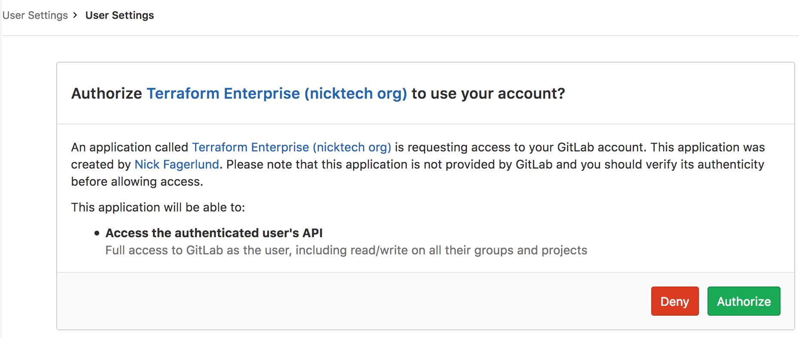

# Configuring GitLab EE and CE Access

These instructions are for using an on-premise installation of GitLab Enterprise Edition (EE) or GitLab Community Edition (CE) for Terraform Enterprise (TFE)'s VCS features. [GitLab.com has separate instructions,](./gitlab-ce-ee.html) as do the [other supported VCS providers.](./index.html)

Connecting TFE to your VCS involves five steps:

On your VCS | On TFE
--|--
Register your TFE organization as a new app. Get ID and key. | &nbsp;
&nbsp; | Tell TFE how to reach VCS, and provide ID and key. Get callback URL.
Provide callback URL. | &nbsp;
&nbsp; | Request VCS access.
Approve access request. | &nbsp;

The rest of this page explains the on-premise GitLab versions of these steps.

## Step 1: On GitLab, Create a New Application

1. Open your GitLab instance in your browser and log in as whichever account you want TFE to act as. For most organizations this should be a dedicated service user, but a personal account will also work.

    ~> **Important:** The account you use for connecting TFE **must have admin (master) access** to any shared repositories of Terraform configurations, since creating webhooks requires admin permissions.

2. Navigate to GitLab's "User Settings > Applications" page.

    This page is located at `https://<INSTANCE HOSTNAME>/profile/applications`. You can also reach it through GitLab's menus:
    - In the upper right corner, click your profile picture and choose "Settings."
    - In the navigation sidebar, click "Applications."

3. This page has a list of applications and a form for adding new ones. The form has two text fields and some checkboxes.

    

    Fill out the form as follows:

    Field            | Value
    -----------------|--------------------------------------------------
    (all checkboxes) | (empty)
    Name             | Terraform Enterprise (`<YOUR ORGANIZATION NAME>`)
    Redirect URI     | `https://example.com/replace-this-later` (or any placeholder; the correct URI doesn't exist until the next step.)

4. Click the "Save application" button, which creates the application and takes you to its page.

5. Take note of two items: the **Application ID** and the **Secret.** You'll copy and paste these unique strings in the next step. Leave this page open in a browser tab.

    

## Step 2: On TFE, Add an OAuth Client

1. Open TFE in your browser and navigate to the "OAuth Configuration" settings for your organization. Click the "Add an OAuth Client" button.

    If you just created your organization, you might already be on this page. Otherwise:

    1. Click the upper-left organization menu, making sure it currently shows your organization.
    1. Click the "`<ORGANIZATION>` Settings" link, right below the name of your organization.
    1. On the next page, click "OAuth Configuration" in the left sidebar.
    1. Click the "Add an OAuth Client" button.

2. The next page has a drop-down and four text fields. Select "GitLab Enterprise Edition" or "GitLab Community Edition" from the drop-down, and fill in all four text fields as follows:

    Field          | Value
    ---------------|--------------------------------------------
    HTTP URL       | `https://<GITLAB INSTANCE HOSTNAME>`
    API URL        | `https://<GITLAB INSTANCE HOSTNAME>/api/v3`
    Application ID | (paste value from previous step)
    Secret         | (paste value from previous step)

    

    Note that TFE uses GitLab's v3 API.

3. Click "Create connection." This will take you back to the OAuth Configuration page, which now includes your new GitLab client.

4. Locate the new client's "Callback URL," and copy it to your clipboard; you'll paste it in the next step. Leave this page open in a browser tab.

    

## Step 3: On GitLab, Update the Callback URL

1. Go back to your GitLab browser tab. (If you accidentally closed it, you can reach your OAuth app page through the menus: use the upper right menu > Settings > Applications > "Terraform Enterprise (`<YOUR ORG NAME>`)".)

2. Click the "Edit" button.

3. In the "Redirect URI" field, paste the callback URL from TFE's OAuth Configuration page, replacing the "example.com" placeholder you entered earlier.

4. Click the "Save application" button. A banner saying the update succeeded should appear at the top of the page.

## Step 4: On TFE, Request Access

1. Go back to your TFE browser tab and click the "Connect organization `<NAME>`" button on the OAuth Configuration page.

    

    This takes you to a page on GitLab.com, asking whether you want to authorize the app.

    

2. Click the green "Authorize" button at the bottom of the authorization page. This returns you to TFE's OAuth Configuration page, where the GitLab.com client's information has been updated.

## Finished

At this point, GitLab.com access for TFE is fully configured, and you can create Terraform workspaces based on your organization's shared repositories.

