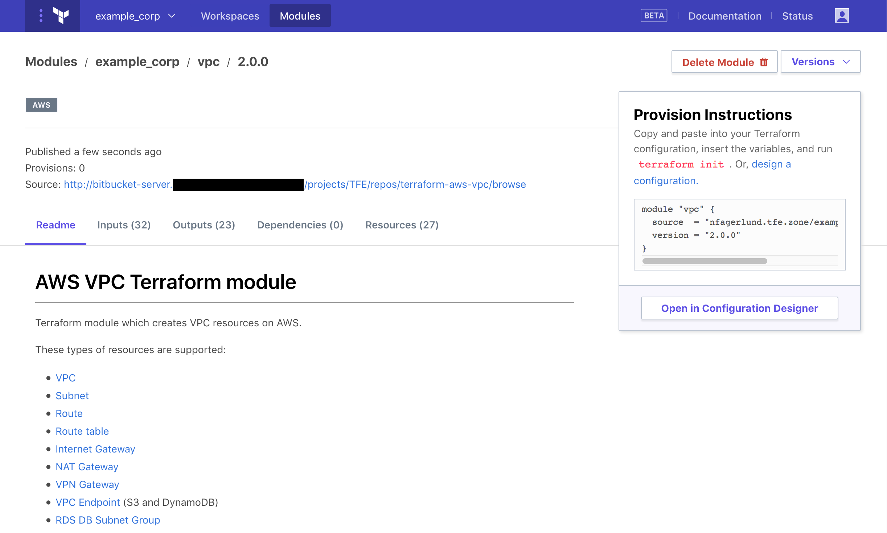

# Using Modules from the Terraform Enterprise Private Module Registry

~> **Note:** Currently, the private module registry works with all supported VCS providers except Bitbucket Cloud.

By design, Terraform Enterprise (TFE)'s private module registry works much like the [public Terraform Registry](/docs/registry/index.html). If you're already familiar with the public registry, here are the main differences:

- Use TFE's web UI to browse and search for modules.
- Module `source` strings are slightly different. The public registry uses a three-part `<NAMESPACE>/<MODULE NAME>/<PROVIDER>` format, and private modules use a four-part `<TFE HOSTNAME>/<TFE ORGANIZATION>/<MODULE NAME>/<PROVIDER>` format. For example, to load a module from the `example_corp` organization on the SaaS version of TFE:

    ```hcl
    module "vpc" {
      source  = "app.terraform.io/example_corp/vpc/aws"
      version = "1.0.4"
    }
    ```
- TFE can automatically access your private modules during Terraform runs. However, when running Terraform on the command line, you must configure a `credentials` block in your [CLI configuration file (`.terraformrc`)](/docs/commands/cli-config.html). See below for the [credentials format](#on-the-command-line).

## Finding Modules

All users in your organization can view your private module registry.

To see which modules are available, click the "Modules" button in TFE's main navigation bar.


This brings you to the modules page, which lists all available modules.


You can browse the complete list, or shrink the list by searching or filtering.

- The "Providers" drop-down filters the list to show only modules for the selected provider.
- The search field searches by keyword. This only searches the titles of modules, not READMEs or resource details.

### Viewing Module Details and Versions

Click a module's "Details" button to view its details page. Use the "Versions" dropdown in the upper right to switch between the available versions, and use the Readme/Inputs/Outputs/Dependencies/Resources tabs to view detailed documentation and information about a version.



## Using Private Modules in Terraform Configurations

In Terraform configurations, you can use any private module from your organization's registry. The syntax for referencing private modules in `source` attributes is `<TFE HOSTNAME>/<TFE ORGANIZATION>/<MODULE NAME>/<PROVIDER>`.

```hcl
module "vpc" {
  source  = "app.terraform.io/example_corp/vpc/aws"
  version = "1.0.4"
}
```

If you're using the SaaS version of TFE, the hostname is `app.terraform.io`; private installs have their own hostnames. The second part of the source string (the namespace) is the name of your TFE organization.

For more details on using modules in Terraform configurations, see ["Using Modules" in the Terraform docs.](/docs/modules/usage.html)

### Usage Examples and the Configuration Designer

Each registry page for a module version includes a usage example, which you can copy and paste to get started.

Alternately, you can use the configuration designer, which lets you select multiple modules and fill in their variables to build a much more useful initial configuration. See [the configuration designer docs](./design.html) for details.

## Referencing Modules Within Private Terraform Enterprise (PTFE)

To use modules published to the current PTFE instance, you can use the hostname `localterraform.com` as the host portion of the source rather than using the literal hostname. For instance:

```hcl
module "vpc" {
  source  = "localterraform.com/example_corp/vpc/aws"
  version = "1.0.4"
}
```

When terraform is executed on the PTFE instance, it will request modules from the same instance automatically. This allows modules to also be refactored
and accessed by other configuration or modules without having to hardcode the hostname of a particular PTFE instance within them.

## Running Configurations with Private Modules

### In Terraform Enterprise

TFE can use your private modules during plans and applies with no extra configuration, _as long as the workspace is configured to use Terraform 0.11 or higher._

A given workspace can only use private modules from the organization it belongs to. If you want to use the same module in multiple organizations, you should add it to both organizations' registries. (See [Sharing Modules Across Organizations](./publish.html#sharing-modules-across-organizations).)

### On the Command Line

If you're using Terraform 0.11 or higher, you can use private modules when applying configurations on the CLI. To do this, you must provide a valid [TFE API token](../users-teams-organizations/users.html#api-tokens).

#### Permissions

When you authenticate with a user token, you can access modules from any organization you are a member of. (A user is a member of an organization if they belong to any team in that organization.)

Within a given Terraform configuration, you should only use modules from one organization. Mixing modules from different organizations might work on the CLI with your user token, but it will make your configuration difficult or impossible to collaborate with. If you want to use the same module in multiple organizations, you should add it to both organizations' registries. (See [Sharing Modules Across Organizations](./publish.html#sharing-modules-across-organizations).)

#### Configuration

To configure private module access, add a `credentials` block to your [CLI configuration file (`.terraformrc`)](/docs/commands/cli-config.html).

``` hcl
credentials "app.terraform.io" {
  token = "xxxxxx.atlasv1.zzzzzzzzzzzzz"
}
```

The block label for the `credentials` block must be TFE's hostname (`app.terraform.io` or the hostname of your private install), and the block body must contain a `token` attribute whose value is a TFE authentication token. You can generate a personal API token from your user settings page in TFE.

Make sure the hostname matches the hostname you use in module sources — if the same TFE server is available at two hostnames, Terraform doesn't have any way to know that they're the same. If you need to support multiple hostnames for module sources, you can add two `credentials` blocks with the same `token`.

~> **Important:** Make sure to protect your API token. When adding an authentication token to your CLI config file, check the file permissions and make sure other users on the same computer cannot view its contents.
