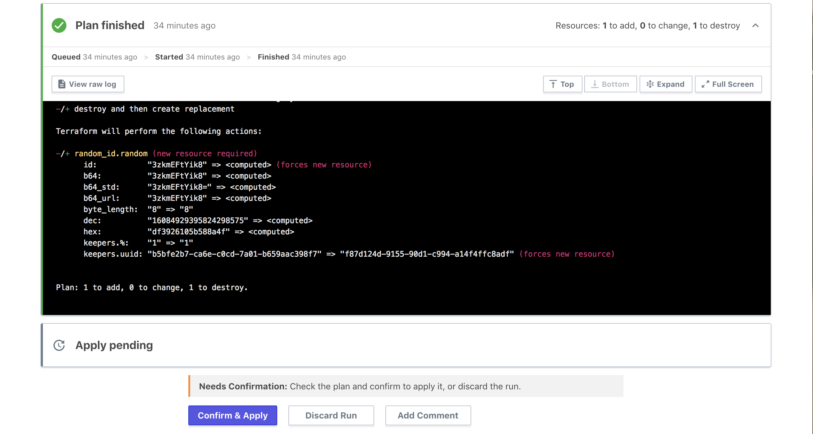

# The UI- and VCS-driven Run Workflow

Terraform Enterprise (TFE) has three workflows for managing Terraform runs.

- The UI/VCS-driven run workflow described below, which is TFE's primary mode of operation.
- The [API-driven run workflow](./api.html), which is more flexible but requires you to create some tooling.
- The [CLI-driven run workflow](./cli.html), which uses Terraform's standard CLI tools to execute runs in TFE.

## Summary

In the UI and VCS workflow, every workspace is associated with a specific branch of a VCS repo of Terraform configurations. TFE registers webhooks with your VCS provider when you create a workspace, then automatically queues a Terraform run whenever new commits are merged to that branch of workspace's linked repository.

TFE also performs a [speculative plan][] when a pull request is opened against that branch from another branch in the linked repository. TFE posts a link to the plan in the pull request, and re-runs the plan if the pull request is updated.

[speculative plan]: ./index.html#speculative-plans

The Terraform code for a normal run always comes from version control, and is always associated with a specific commit.

## Starting Runs

Most of the time, runs start automatically whenever you commit changes to version control through a merge or direct commit to the target branch.

When you initially set up the workspace and add variables, or when the code in version control hasn't changed but you've modified some variables in TFE, you can manually queue a plan from the UI. Each workspace has a "Queue Plan" button for this purpose. Manually queueing a plan requires write or admin access.

If the workspace has a plan that is still in the [plan stage](./states.html#2-the-plan-stage) when a new plan is queued, you can either wait for it to complete, or visit the "Current Run" page and click "Run this plan now". Be aware that this will terminate the current plan and unlock the workspace, which can lead to anomalies in behavior, but can be useful if the plans are long-running and the current plan is known not to have all the desired changes.

## Confirming or Discarding Plans

By default, run plans require confirmation before TFE will apply them. Users with write access on a workspace can navigate to a run that has finished planning and click the "Confirm & Apply" or "Discard Plan" button to finish or cancel a run. If necessary, use the "View Plan" button for more details about what the run will change.

Users can also leave comments if there's something unusual involved in a run.

Note that once the plan stage is completed, until you apply or discard a plan, TFE can't start another run in that workspace.

### Auto apply

If you would rather automatically apply plans that don't have errors, you can enable auto apply on the workspace's settings tab.

## Speculative Plans on Pull Requests

When a pull request is made to a linked repository, each environment linked to that repository runs a [speculative plan][] and posts a link to the plan in the pull request. Members of your organization can consult the results of these plans when reviewing pull requests. Speculative plans are re-run if the code in a pull request is updated.

Due to VCS providers' access controls, this feature only works for pull requests that originate _from_ the linked repository — pull requests that originate from other forks of the repository do not receive speculative plans, since TFE can't reliably access or monitor the contents of those forks.

## Speculative Plans During Development

You can also run speculative plans on demand before making a pull request, using the remote backend and the `terraform plan` command. For more information, see [the CLI-driven run workflow](./cli.html).
