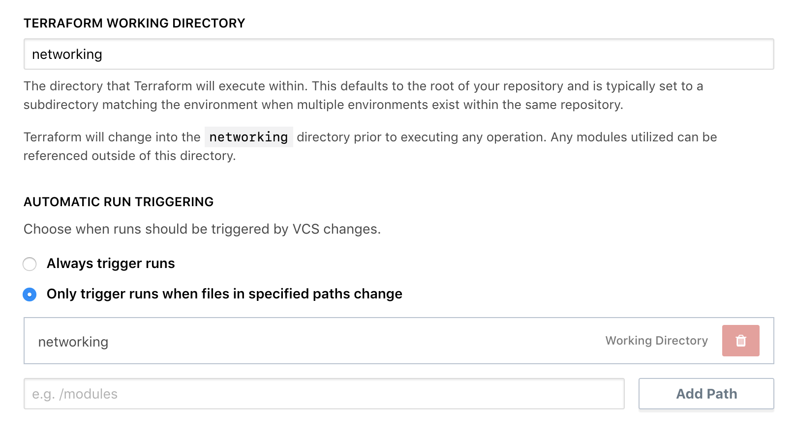

# Filtering Run Triggers

~> **Beta Feature:** This page describes functionality which is in early access, and not widely available yet. When this feature is shipped, the information in this page will be moved to [UI/VCS-driven Runs][vcs-runs], [Workspace Settings][settings], and [Workspace Repository Structure][repo-structure].

[vcs-runs]: ./ui.html
[settings]: ../workspaces/settings.html
[repo-structure]: ../workspaces/repo-structure.html#directories

If you have several Terraform Enterprise (TFE) workspaces attached to a [monolithic repository][repo-structure] (monorepo) that contains multiple separate Terraform configurations, you can configure which directories in that repo are relevant to each workspace. If you do, TFE will apply your intended changes more quickly and queue fewer unnecessary runs.

## Configuring Run Triggers

You can configure which parts of a repo will trigger runs in a workspace on its ["Version Control" settings page](../workspaces/settings.html#version-control), as well as when creating a new workspace:

For workspaces that **don't** specify a Terraform working directory, TFE assumes that the entire repository is relevant to the workspace. Any change will trigger a run.

For workspaces that **do** specify a Terraform working directory, TFE assumes that only _some_ content in the repository is relevant to the workspace. Only changes that affect the relevant content will trigger a run. By default, only the working directory is considered relevant.

You can adjust this behavior in two ways:

- **Add more trigger directories.** TFE will queue runs for changes in any of the specified trigger directories (including the working directory).

    For example, if you use a top-level `modules` directory to share Terraform code across multiple configurations, changes to the shared modules are relevant to every workspace that uses that repo. You can add `modules` as a trigger directory for each workspace to make sure they notice any changes to shared code.
- **Mark the entire repository as relevant.** If you set the "Automatic Run Triggering" setting to "Always Trigger Runs," TFE will assume that anything in the repository might affect the workspace's configuration, and will queue runs for any change.

    This can be useful for repos that don't have multiple configurations but require a working directory for some other reason. It's usually not what you want for true monorepos, since it queues unnecessary runs and slows down your ability to provision infrastructure.

-> **Note:** Trigger directories also apply to [speculative plans](./index.html#speculative-plans) on pull requests — TFE won't queue plans for changes that aren't marked as relevant.

## Error Handling

Terraform Enterprise retrieves the changed files for each push or pull request using your VCS provider's API. If for some reason the list of changed files cannot be retrieved, or if it is too large to process, the default behaviour is to trigger runs on all attached workspaces. Should this happen, you may see several runs with state "Planned", due to the push resulting in no changes to infrastructure.
