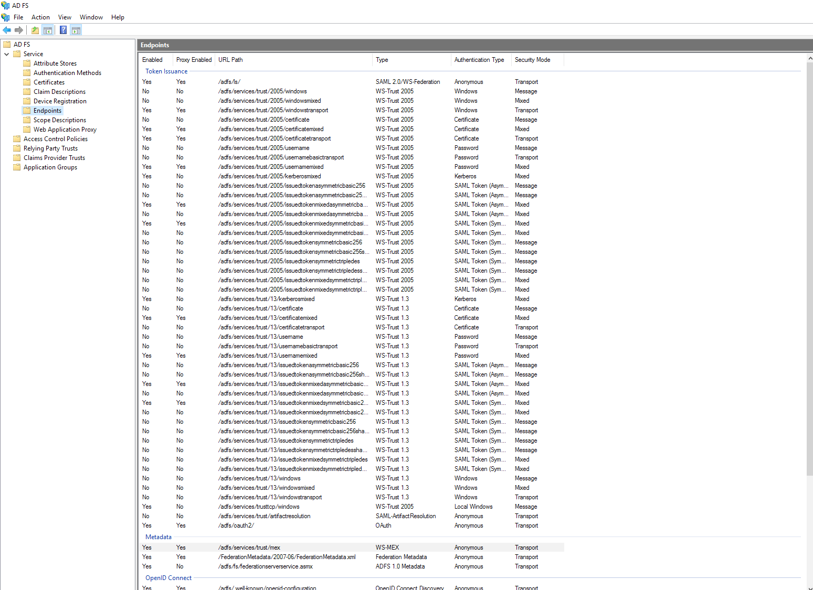
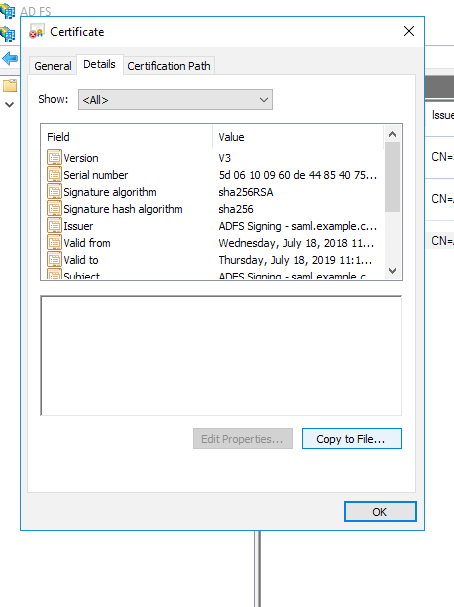
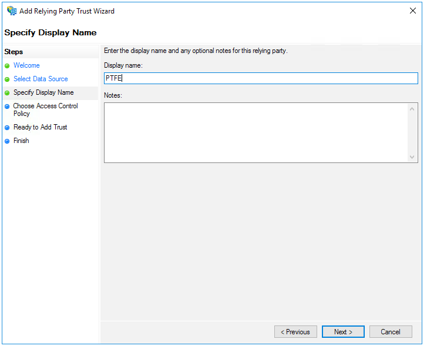
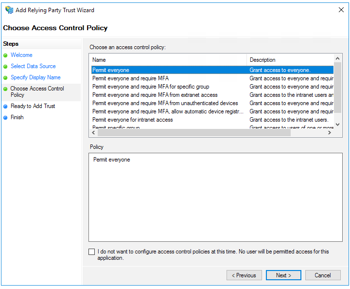
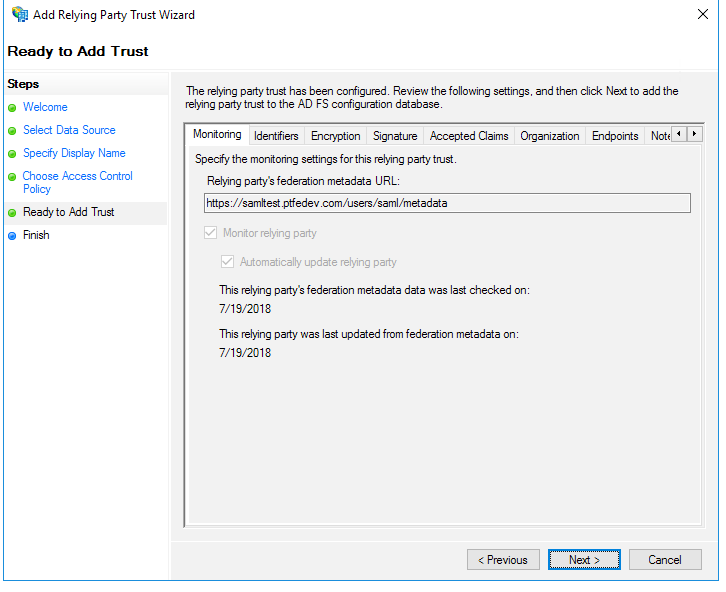

This guide will explain how to configure Active Directory Federated Services (ADFS) in order to use them as an Identity Provider (IdP) for PTFE's SAML authentication feature. The screenshots below were taken on Windows Server 2016 so you may not look the same on previous Windows versions.

This doc assumes that you have already installed and configured ADFS and that you are using PTFE version v201807-1 or later.

## Step 1 - Information gathering and PTFE configuration

#### On the ADFS server

1. Start the Server Manager.
  

2. Click on Tools -> AD FS Management
  .

3. Expand the `Service`object and click on `Endpoints`.
  

4. Make a note of the `URL Path` for Type `SAML 2.0/WS-Federation`. If you are using the default settings, this should be `/adfs/ls/`.

5. Next click on Certificates and choose the one under `Token-signing`.
  

6. Right click -> `View Certificate` .
  

7. On the Certificate form select `Details` and click on `Copy to File`.
  

8. On the new screen, click `Next, `select `Base-64 encoded X.509 (.CER)` and click `Next` again.
  

9. Pick a location to save the file and click `Next`,
  
10. Review the settings and click on `Finish`.
  

####On PTFE

For the next steps we will need the following items:

* The ADFS server hostname.
* The `URL Path`configured in step 4 above.
* The contents of the certificate we saved in step 8 above.

1. Visit https://<your ptfe hostname>/app/admin/saml .
2. Set `Single Sign-on URL` to https://<ADFS hostname>/<URL Path> .
3. Set `Single log-out URL`to https://<ADFS hostname>/<URL Path>?wa=wsignout1.0 .
4. Paste the contents of the certificate in `IDP Certificate`.
5. Scroll to the bottom of the screen and click `Save SAML Settings`.

## Step 2 - ADFS Configuration

#### On the ADFS server

##### Configure the Relaying Party (RP) Trust

1. Start the Server Manager.
   

2. Click on Tools -> AD FS Management
   .

   

3. Right click on `Relying Party Trusts`and then click on `Add Relying Party Trust`.

    

4. In the next dialog select `Claims aware` and click on `Start`.
   

5. Next select `Import data about the relying party published online or on a local network` and in the textbox type `https://<PTFE hostname>/users/saml/metadata`.

   

6. Click `Next`, type a display name used to identify the RP trust and click on `Next` again.
   

7. In the next dialog you choose the access control policy. Choose one that matches your security policy and then click `Next`.
   

8. Review the settings and click `Next`.
   

9. Finally, make sure the checkbox next to `Configure claims issuance policy for this application` is checked and click on `Close`. This will open the `Claim Issuance Policy editor` for the RP trust we just configured.
   

##### Claims Configuration

1. Click on `Add Rule`and in the new screen select `Send LDAP Attributes as Claims` from the `Claim rule template`dropdown. Click  `Next`.

2. Set a name used to identify the claim rule, set the attribute store to `Active Directory`and then:
   - From the `LDAP Attribute` column, select `E-Mail Addresses`.
   - From the `Outgoing Claim Type`, select `E-Mail Address`. 

   

3. Click on `Finish`.

4. Click on `Add Rule`and in the new screen select `Transform an Incoming Claim` from the `Claim rule template`dropdown. Click `Next`.
   

5. Set a name used to identify the claim rule and then:
   * Select `E-mail Address` as the `Incoming Claim Type`.

   * For `Outgoing Claim Type`, select `Name ID`.

   * For `Outgoing Name ID Format`, select `Email`. 

     

6. Click on `Finish`.

7. Click on `Add Rule`and in the new screen select `Send Group Membership as a Claim` from the `Claim rule template`dropdown. Click `Next`.

8. Click on `Browse` and locate the AD User group that contains all the PTFE admins.
   
9. Set `Outgoing claim type` to `Group,` `Outgoing claim value` to `MemberOf`, and click `Finish`.
   

## Step 3 - Login

At this point SAML is configured and you should follow [these instructions](docs/enterprise/saml/login.html) in order to login to Terraform Enterprise.
