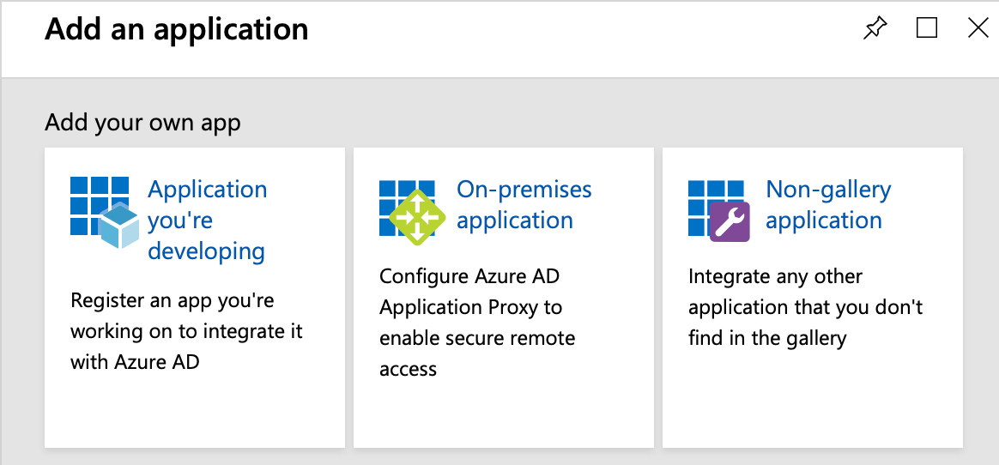
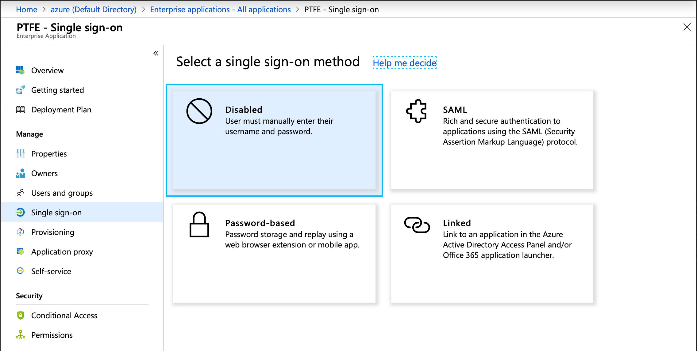
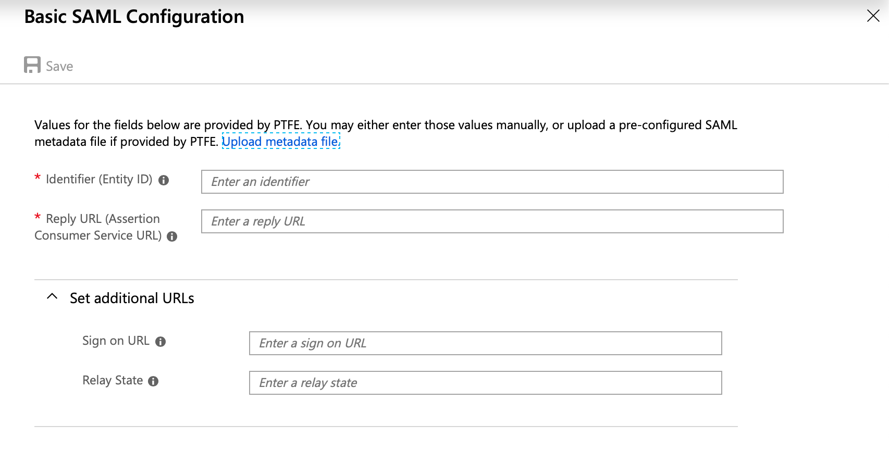
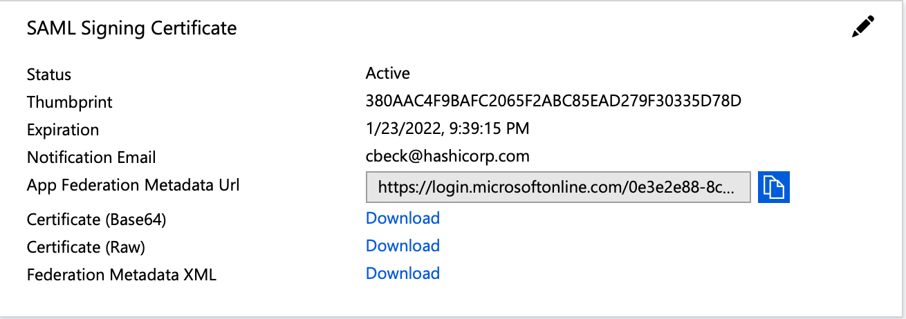
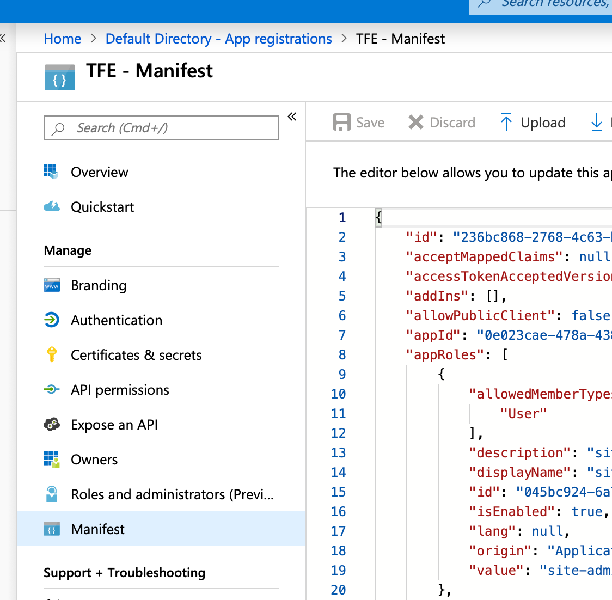
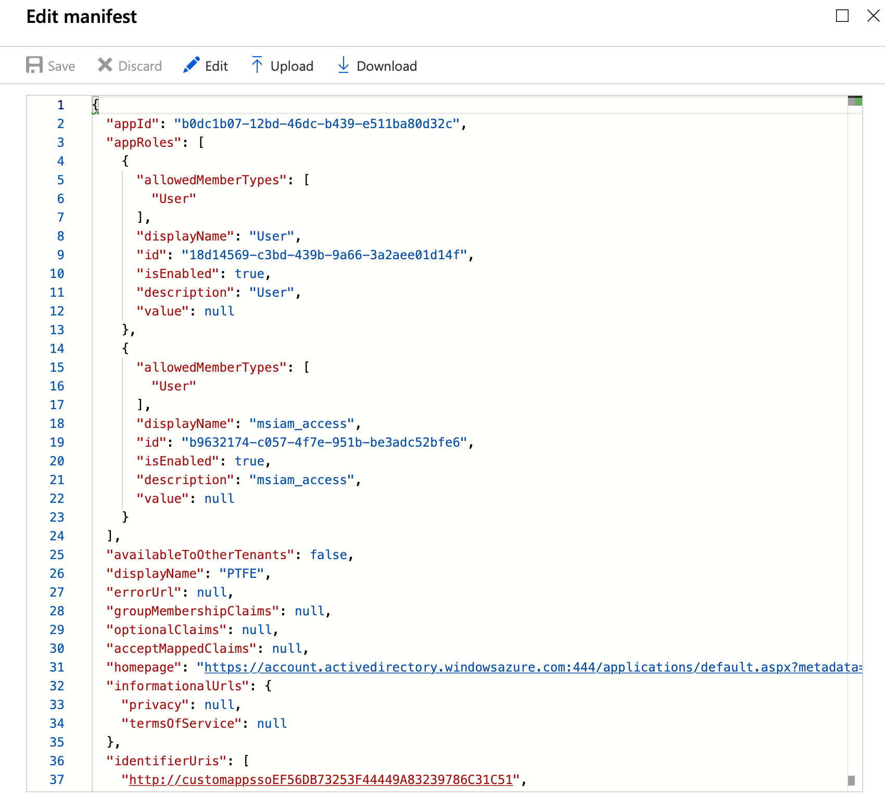
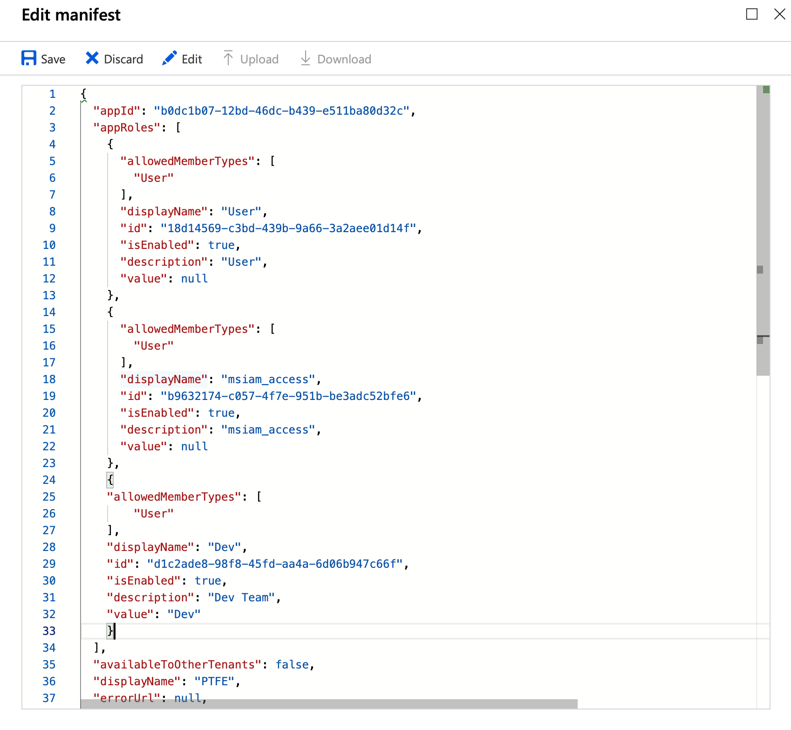
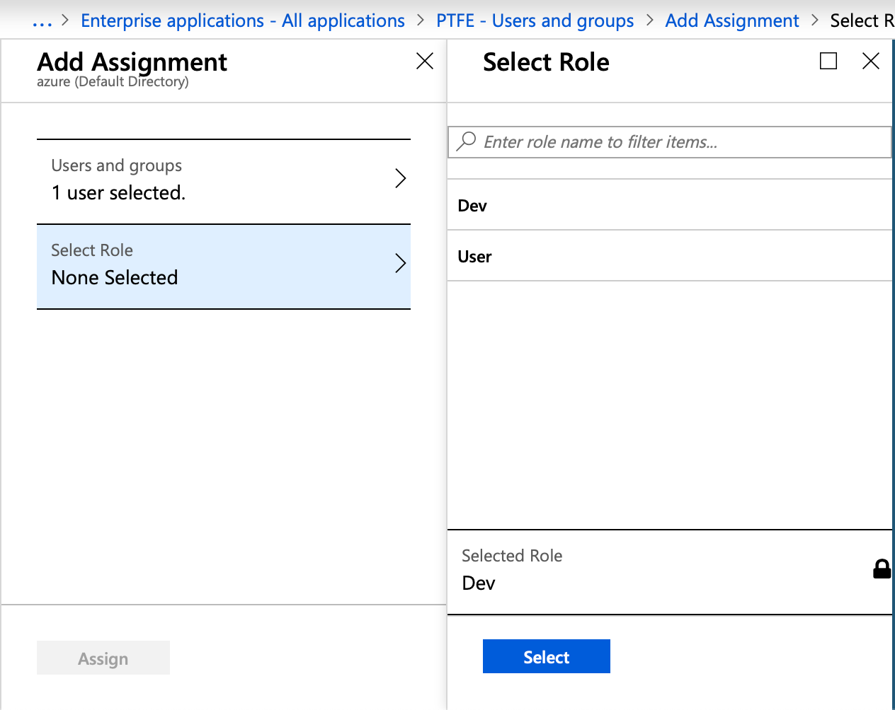

# AAD Configuration

Follow these steps to configure Azure Active Directory (AAD) as the identity provider (IdP) for Private Terraform Enterprise (PTFE).

This guide assumes you have an appropriate licensing agreement for Azure Active Directory that supports non-gallery appplication single sign-on.

## Configure a New AAD Non-Gallery Application

1. In the Azure portal, navigate to Azure Active Directy > Enterprise Applications and select Add an Application.
  
2. Select Non-gallery application. Provide a name for the application and click Add.
  
3. AAD should automatically redirect to your new application settings, navigate to Single sign-on and select SAML
  
4. Select the pencil within the Basic SAML Configuration and configure the following settings with the specified values:
    - **Identifier (Entity ID):** `https://<TFE HOSTNAME>/users/saml/metadata` (listed as "Metadata (audience) URL" in TFE's SAML settings).
    - **Reply URL (Assertion Consumer Service URL):** `https://<TFE HOSTNAME>/users/saml/auth` (listed as "ACS consumer (recipient) URL" in TFE's SAML settings).
    - **Sign on URL:** `https://<TFE HOSTNAME>/`
    
5. In the User Attributes & Claims section select the pencil and configure the following items:
    - **Name Identifier value:** `user.mail`
    
6. Still in the "User Attributes & Claims" page, configure a user claim to map which team a user belongs to. Under "Manage user claims" page, configure the following:
    - **Name:** `MemberOf` (This is the default name for TFE's group [attribute][./attributes.html]; the name of this attribute can be changed in [TFE's SAML settings](./configuration.html) if necessary.)
    - **Source attribute:** (drop-down): user.assignedroles (Custom roles will be created in Azure Active Directory that will be used to map users and groups to TFE teams.)
    
7. Under the "SAML Signing Certificate" header, download the signing certificate in base64 format
    
8. Still in the "Single Sign On Configuration" page, under the "Set up <AAD App Name>", copy the following urls that we will enter in our TFE configuration to link TFE to AAD:
    - **Login URL:**
    - **Logout URL:**
    
9. Navigate to `https://<TFE_HOSTNAME>/app/admin/saml` and configure the following:
    - **Enable SAML single sign-on** (check box): enabled.
    - **Single Sign-On URL:** Enter the login url from step 8.
    - **Single Log-out URL:** Enter the logout url from step 8.
    - **IDP Certificate:** Enter the contents of the PEM (Based64) encoded X.509 certificate captured in step 7.

## Configure Custom Roles for Team Membership Mapping

1. Create teams in TFE as outlined in [TFE Team Membership](./team-membership.html)
2. Return to the Azure Portal, navigate to "App Registration" page, and search for the application you created for TFE. Select your app and select "Manifest".
    
3. In the manifest editor, locate the "appRoles" block. This is where you will add additional roles that map users and groups to teams in TFE.
    
4. The "appRoles" block may contain roles automatically generated by AAD. New roles should be added after the system roles and must contain a unique GUID value for the ID value of the new role. You can use a tool such as [GUID Generator](https://www.guidgenerator.com). Click save to add role.

    Example role configuration that creates a new role name Dev:
    ```{
    "allowedMemberTypes": [
        "User"
    ],
    "displayName": "Dev",
    "id": "d1c2ade8-98f8-45fd-aa4a-6d06b947c66f",
    "isEnabled": true,
    "description": "Dev Team",
    "value": "Dev"
    }```
    
5. Back in your application properties, under "Manage" heading, select "Users and Groups". This is where you will enable access to TFE by adding either users or groups to your application. During the process of adding users or groups you will select a role to be assigned to the user or group. Select the role that matches the user or groups TFE team.
    
6. Once users have been added they can begin logging into TFE with their AAD username and password.