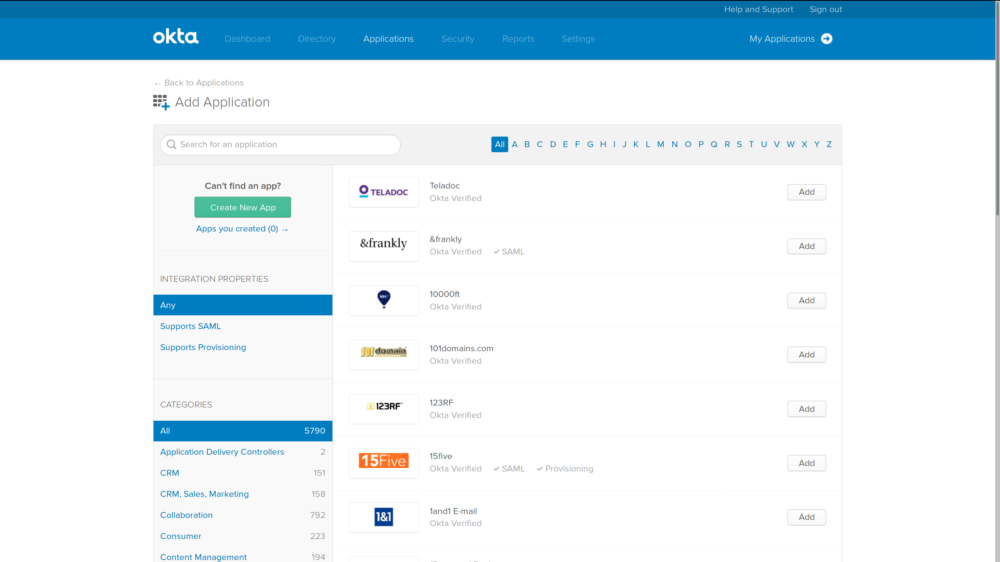
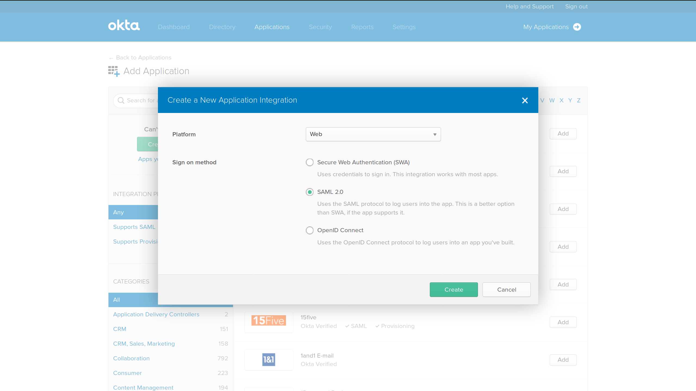
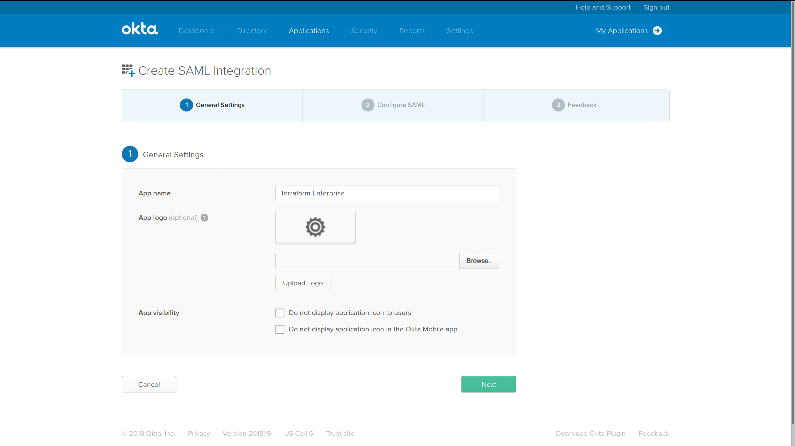
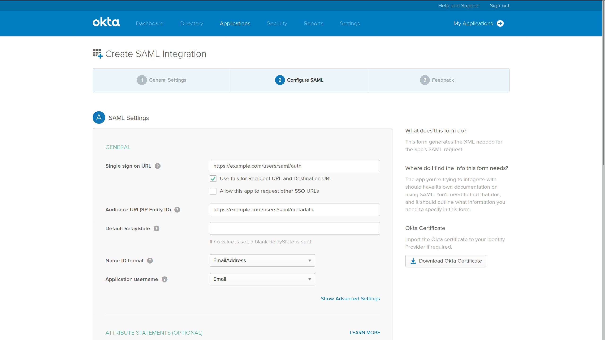
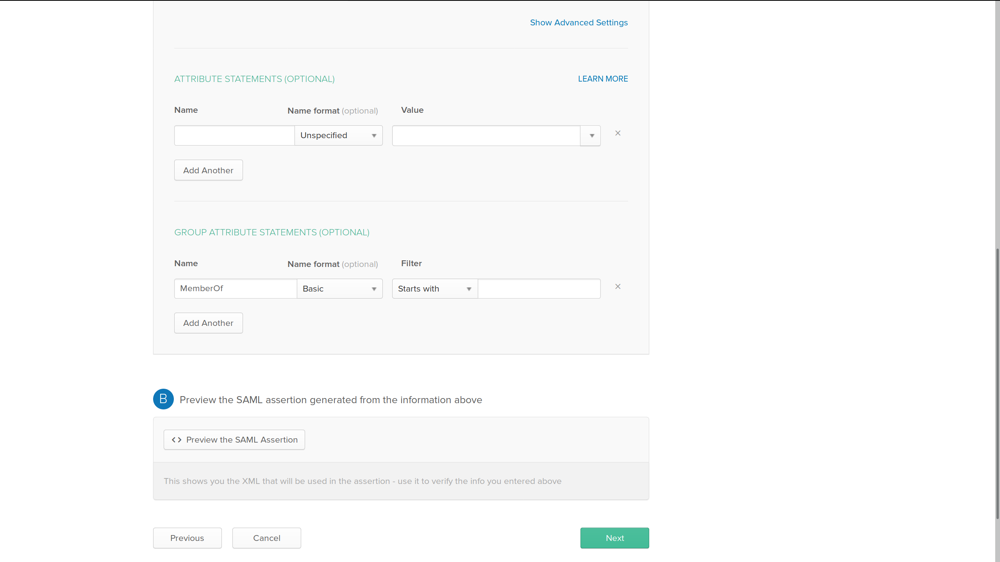

# Okta Configuration

Follow these steps to configure Okta as the identity provider (IdP) for Terraform Enterprise.

1. Go to the Applications tab and click Create New App
  
2. Select SAML 2.0
  
3. Enter an app name
  
3. Configure **Single sign on URL**, **Audience URI (SP Entity ID)**, **Name ID format**, and **Application username**
  
5. Add [attributes](./attributes.html)
  
5. Copy the endpoint URLs and certificate to your Terraform Enterprise SAML settings at `https://TFE_HOSTNAME<>/admin/integrations/saml`.

## Example SAMLResponse

```xml
<?xml version="1.0" encoding="UTF-8"?>
<saml2p:Response xmlns:saml2p="urn:oasis:names:tc:SAML:2.0:protocol" Destination="https://example.com/users/saml/auth" ID="id1" InResponseTo="_a6d4052d-4dca-4816-b811-a81834681d40" IssueInstant="2018-05-30T15:27:58.831Z" Version="2.0" xmlns:xs="http://www.w3.org/2001/XMLSchema">
  <saml2:Issuer xmlns:saml2="urn:oasis:names:tc:SAML:2.0:assertion" Format="urn:oasis:names:tc:SAML:2.0:nameid-format:entity">http://www.okta.com/1</saml2:Issuer>
  <ds:Signature xmlns:ds="http://www.w3.org/2000/09/xmldsig#">
    <ds:SignedInfo>
      <ds:CanonicalizationMethod Algorithm="http://www.w3.org/2001/10/xml-exc-c14n#"/>
      <ds:SignatureMethod Algorithm="http://www.w3.org/2001/04/xmldsig-more#rsa-sha256"/>
      <ds:Reference URI="#id1">
        <ds:Transforms>
          <ds:Transform Algorithm="http://www.w3.org/2000/09/xmldsig#enveloped-signature"/>
          <ds:Transform Algorithm="http://www.w3.org/2001/10/xml-exc-c14n#">
            <ec:InclusiveNamespaces xmlns:ec="http://www.w3.org/2001/10/xml-exc-c14n#" PrefixList="xs"/>
          </ds:Transform>
        </ds:Transforms>
        <ds:DigestMethod Algorithm="http://www.w3.org/2001/04/xmlenc#sha256"/>
        <ds:DigestValue>000000000000000000000000000=</ds:DigestValue>
      </ds:Reference>
    </ds:SignedInfo>
    <ds:SignatureValue>000000000000000000000000000000000000000000000000000000000000000000000000000000000000000000000000000000000000000000000000000000000000000000000000000000000000000000000000000000000000000000000000000000000000000000000000000000000000000000000000000000000000000000000000000000000000000000000000000000000000000000000000000000000000000000000000000000==</ds:SignatureValue>
    <ds:KeyInfo>
      <ds:X509Data>
        <ds:X509Certificate>000000000000000000000000000000000000000000000000000000000000000000000000000000000000000000000000000000000000000000000000000000000000000000000000000000000000000000000000000000000000000000000000000000000000000000000000000000000000000000000000000000000000000000000000000000000000000000000000000000000000000000000000000000000000000000000000000000000000000000000000000000000000000000000000000000000000000000000000000000000000000000000000000000000000000000000000000000000000000000000000000000000000000000000000000000000000000000000000000000000000000000000000000000000000000000000000000000000000000000000000000000000000000000000000000000000000000000000000000000000000000000000000000000000000000000000000000000000000000000000000000000000000000000000000000000000000000000000000000000000000000000000000000000000000000000000000000000000000000000000000000000000000000000000000000000000000000000000000000000000000000000000000000000000000000000000000000000000000000000000000000000000000000000000000000000000000000000000000000000000000000000000000000000000000000000000000000000000000000000000000000000000000000000000000000000000000000000000000000000000000000000000000000000000000000000000000000000000000000000000000000000000000000000000000000000000000000000000000000000000000000000000000000000000000000000000000000000000000000000000000000000000000000000000000000000000000000000000000000000000000000000000000000000000000000000==</ds:X509Certificate>
      </ds:X509Data>
    </ds:KeyInfo>
  </ds:Signature>
  <saml2p:Status xmlns:saml2p="urn:oasis:names:tc:SAML:2.0:protocol">
    <saml2p:StatusCode Value="urn:oasis:names:tc:SAML:2.0:status:Success"/>
  </saml2p:Status>
  <saml2:Assertion xmlns:saml2="urn:oasis:names:tc:SAML:2.0:assertion" ID="id2" IssueInstant="2018-05-30T15:27:58.831Z" Version="2.0" xmlns:xs="http://www.w3.org/2001/XMLSchema">
    <saml2:Issuer Format="urn:oasis:names:tc:SAML:2.0:nameid-format:entity" xmlns:saml2="urn:oasis:names:tc:SAML:2.0:assertion">http://www.okta.com/1</saml2:Issuer>
    <ds:Signature xmlns:ds="http://www.w3.org/2000/09/xmldsig#">
      <ds:SignedInfo>
        <ds:CanonicalizationMethod Algorithm="http://www.w3.org/2001/10/xml-exc-c14n#"/>
        <ds:SignatureMethod Algorithm="http://www.w3.org/2001/04/xmldsig-more#rsa-sha256"/>
        <ds:Reference URI="#id2">
          <ds:Transforms>
            <ds:Transform Algorithm="http://www.w3.org/2000/09/xmldsig#enveloped-signature"/>
            <ds:Transform Algorithm="http://www.w3.org/2001/10/xml-exc-c14n#">
              <ec:InclusiveNamespaces xmlns:ec="http://www.w3.org/2001/10/xml-exc-c14n#" PrefixList="xs"/>
            </ds:Transform>
          </ds:Transforms>
          <ds:DigestMethod Algorithm="http://www.w3.org/2001/04/xmlenc#sha256"/>
          <ds:DigestValue>000000000000000000000000000=</ds:DigestValue>
        </ds:Reference>
      </ds:SignedInfo>
      <ds:SignatureValue>000000000000000000000000000000000000000000000000000000000000000000000000000000000000000000000000000000000000000000000000000000000000000000000000000000000000000000000000000000000000000000000000000000000000000000000000000000000000000000000000000000000000000000000000000000000000000000000000000000000000000000000000000000000000000000000000000000==</ds:SignatureValue>
      <ds:KeyInfo>
        <ds:X509Data>
          <ds:X509Certificate>000000000000000000000000000000000000000000000000000000000000000000000000000000000000000000000000000000000000000000000000000000000000000000000000000000000000000000000000000000000000000000000000000000000000000000000000000000000000000000000000000000000000000000000000000000000000000000000000000000000000000000000000000000000000000000000000000000000000000000000000000000000000000000000000000000000000000000000000000000000000000000000000000000000000000000000000000000000000000000000000000000000000000000000000000000000000000000000000000000000000000000000000000000000000000000000000000000000000000000000000000000000000000000000000000000000000000000000000000000000000000000000000000000000000000000000000000000000000000000000000000000000000000000000000000000000000000000000000000000000000000000000000000000000000000000000000000000000000000000000000000000000000000000000000000000000000000000000000000000000000000000000000000000000000000000000000000000000000000000000000000000000000000000000000000000000000000000000000000000000000000000000000000000000000000000000000000000000000000000000000000000000000000000000000000000000000000000000000000000000000000000000000000000000000000000000000000000000000000000000000000000000000000000000000000000000000000000000000000000000000000000000000000000000000000000000000000000000000000000000000000000000000000000000000000000000000000000000000000000000000000000000000000000000000000000==</ds:X509Certificate>
        </ds:X509Data>
      </ds:KeyInfo>
    </ds:Signature>
    <saml2:Subject xmlns:saml2="urn:oasis:names:tc:SAML:2.0:assertion">
      <saml2:NameID Format="urn:oasis:names:tc:SAML:1.1:nameid-format:emailAddress">user@example.com</saml2:NameID>
      <saml2:SubjectConfirmation Method="urn:oasis:names:tc:SAML:2.0:cm:bearer">
        <saml2:SubjectConfirmationData InResponseTo="_a6d4052d-4dca-4816-b811-a81834681d40" NotOnOrAfter="2018-05-30T15:32:58.831Z" Recipient="https://example.com/users/saml/auth"/>
      </saml2:SubjectConfirmation>
    </saml2:Subject>
    <saml2:Conditions NotBefore="2018-05-30T15:22:58.831Z" NotOnOrAfter="2018-05-30T15:32:58.831Z" xmlns:saml2="urn:oasis:names:tc:SAML:2.0:assertion">
      <saml2:AudienceRestriction>
        <saml2:Audience>https://example.com/users/saml/metadata</saml2:Audience>
      </saml2:AudienceRestriction>
    </saml2:Conditions>
    <saml2:AuthnStatement AuthnInstant="2018-05-30T15:11:50.514Z" SessionIndex="_a6d4052d-4dca-4816-b811-a81834681d40" xmlns:saml2="urn:oasis:names:tc:SAML:2.0:assertion">
      <saml2:AuthnContext>
        <saml2:AuthnContextClassRef>urn:oasis:names:tc:SAML:2.0:ac:classes:PasswordProtectedTransport</saml2:AuthnContextClassRef>
      </saml2:AuthnContext>
    </saml2:AuthnStatement>
    <saml2:AttributeStatement xmlns:saml2="urn:oasis:names:tc:SAML:2.0:assertion">
      <saml2:Attribute Name="Username" NameFormat="urn:oasis:names:tc:SAML:2.0:attrname-format:basic">
        <saml2:AttributeValue xmlns:xs="http://www.w3.org/2001/XMLSchema" xmlns:xsi="http://www.w3.org/2001/XMLSchema-instance" xsi:type="xs:string">new_username</saml2:AttributeValue>
      </saml2:Attribute>
      <saml2:Attribute Name="MemberOf" NameFormat="urn:oasis:names:tc:SAML:2.0:attrname-format:basic">
        <saml2:AttributeValue xmlns:xs="http://www.w3.org/2001/XMLSchema" xmlns:xsi="http://www.w3.org/2001/XMLSchema-instance" xsi:type="xs:string">devs</saml2:AttributeValue>
        <saml2:AttributeValue xmlns:xs="http://www.w3.org/2001/XMLSchema" xmlns:xsi="http://www.w3.org/2001/XMLSchema-instance" xsi:type="xs:string">reviewers</saml2:AttributeValue>
      </saml2:Attribute>
    </saml2:AttributeStatement>
  </saml2:Assertion>
</saml2p:Response>
```
