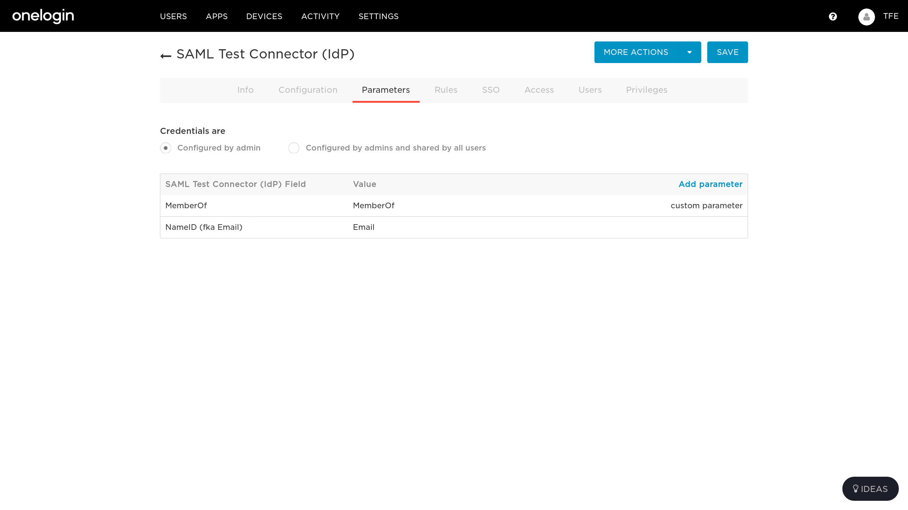
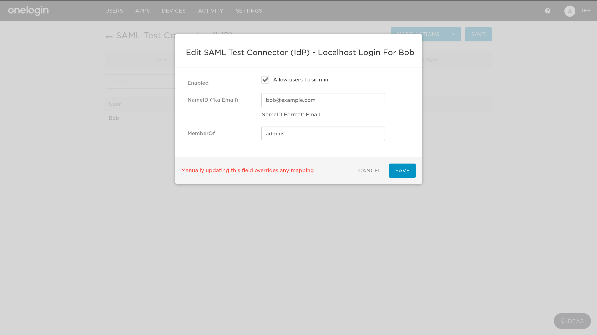

# OneLogin Configuration

Follow these steps to configure OneLogin as the identity provider (IdP) for Terraform Enterprise (TFE).

1. Add a OneLogin app by going to Apps > Add Apps then searching for "SAML Test Connector (IdP)".
2. In the "Info" tab, enter an app name for Terraform Enterprise in the "Display Name" field.
  
3. In the "Configuration" tab, configure the service provider audience and recipient URLs. These are shown in your Terraform Enterprise SAML settings at `https://<TFE HOSTNAME>/app/admin/saml`.
  
4. In the "Parameters" tab, map the NameId and MemberOf parameters.
  
  
5. In the "SSO" tab, copy the endpoint URLs and certificate, then paste them into your Terraform Enterprise SAML settings at `https://<TFE HOSTNAME>/app/admin/saml`. (Use the certificate's "View Details" link to copy its PEM-encoded text representation.)
  
  
6. In the "Access" tab, enable access for specific roles.
  
7. In the "Users" tab, add users and specify their roles.
  
  

## Terraform Enterprise SAML SSO settings

Verify the endpoint URLs, certificate, and attribute mappings are correct in the SAML SSO settings.

