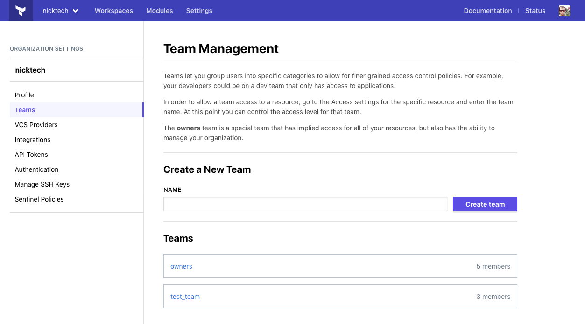
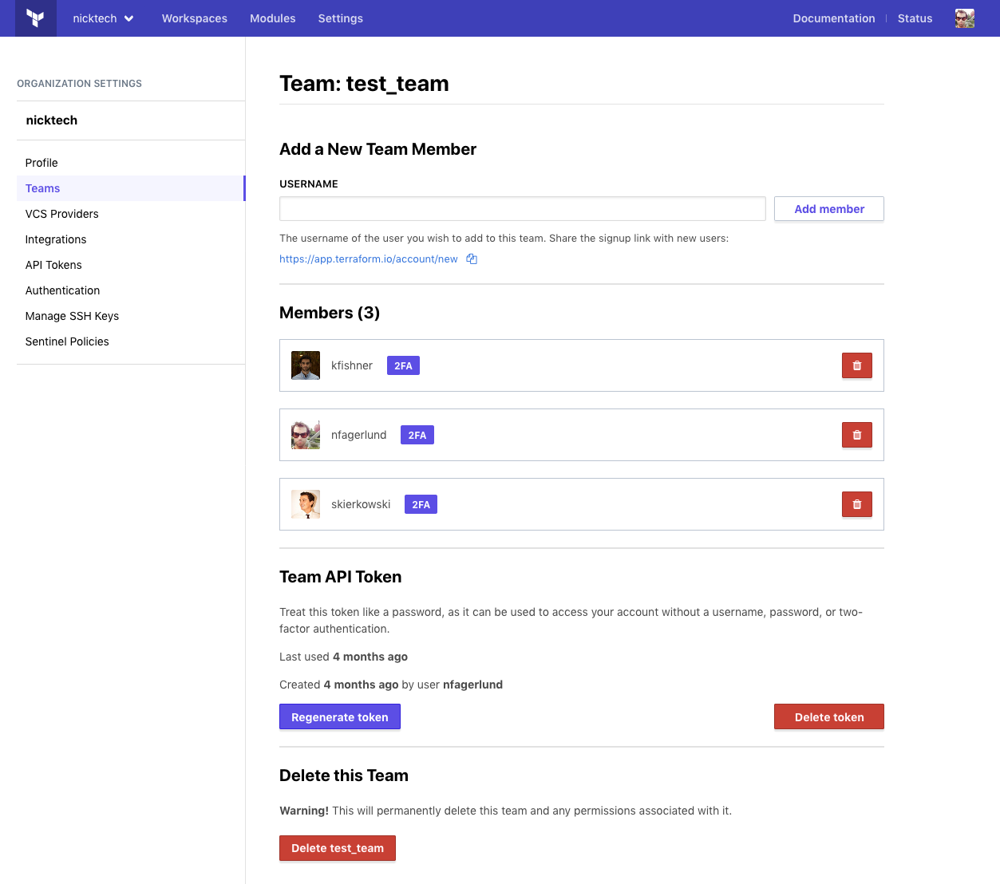

[organizations]: ./organizations.html
[organization settings]: ./organizations.html#organization-settings
[users]: ./users.html

# Teams

Teams are groups of Terraform Enterprise (TFE) [users][] within an [organization][organizations]. To delegate provisioning work, the organization's owners can grant workspace permissions to specific teams.

Teams can only have permissions on workspaces within their organization, although any user in a team can belong to teams in other organizations.

If a user belongs to at least one team in an organization, they are considered a member of that organization.

## The Owners Team

Every organization has a team named `owners`, whose members have special permissions. In TFE's documentation and UI, members of the owners team are sometimes called organization owners.

An organization's creator is the first member of its owners team; other members can be added or removed in the same way as other teams. Unlike other teams, the owners team can't be deleted and can't be empty; if there is only one member, you must add another before removing the current member.

Members of the owners team have full access to every workspace in the organization. Additionally, the following tasks can only be performed by organization owners:

- Creating new workspaces
- Managing Sentinel policies
- Overriding `soft mandatory` Sentinel policies
- Creating and deleting teams
- Managing team membership
- Viewing the full list of teams
- Managing [organization settings][]

## Managing Teams

Teams are managed in the [organization settings][]. Click the "Settings" link in the top navigation bar, then click the "Teams" link in the left sidebar.

The teams page includes a list of the organization's teams. Clicking a team in the list loads its team settings page, which manages its membership and other settings:

The team settings page lists the team's current members, with badges to indicate which users have [two-factor authentication](./2fa.html) enabled.

Only organization owners can manage teams or view the full list of teams. Other users can view the teams page in read-only mode and view any teams they are members of.

### Creating and Deleting Teams

-> **API:** See the [Teams API](../api/teams.html).

Organization owners can create new teams from the teams page, using the controls under the "Create a New Team" header.

To create a new team, provide a name (unique within the organization) and click the "Create team" button. Team names can include numbers, letters, underscores (`_`), and hyphens (`-`).

To delete a team, go to the target team's settings page and click the "Delete TEAM NAME" button.

### Managing Team Membership

-> **API:** See the [Team Members API](../api/team-members.html).

Organization owners can use a team's settings page to add and remove users from the team.

To add a user, enter their username in the "Username" text field (located under the "Add a New Team Member" header) and click the "Add member" button. (You must know the user's TFE username; users cannot be added using email addresses or other personal information.)

To remove a user, click the "🗑" (trash can) button by their entry in the member list.

Typically, your team structure will mirror your company's group structure. The [Terraform Recommended Practices guide](/docs/enterprise/guides/recommended-practices/index.html) offers more in-depth discussion of how team structure interacts with the structure of your Terraform configurations and the IT infrastructure they manage.

### API Tokens

-> **API:** See the [Team Tokens API](../api/team-tokens.html).

Each team can have a special service account API token that is not associated with a specific user. You can manage this API token from the team's settings page. See [Service Accounts](./service-accounts.html) for more information.

## Managing Workspace Access

-> **API:** See the [Team Access API](../api/team-access.html).

A team can be given read, write, or admin permissions on one or more workspaces.

- Use any workspace's "Access" tab to manage team permissions on that workspace. For full instructions, see [Managing Access to Workspaces](../workspaces/access.html).
- For detailed information about the available permissions levels, see [Permissions](./permissions.html).

When determining whether a user can take an action on a resource, TFE uses the highest permission level from that user's teams. (For example, if a user belongs to a team with read permissions on a workspace and another team with admin permissions on that workspace, that user has admin permissions.)
