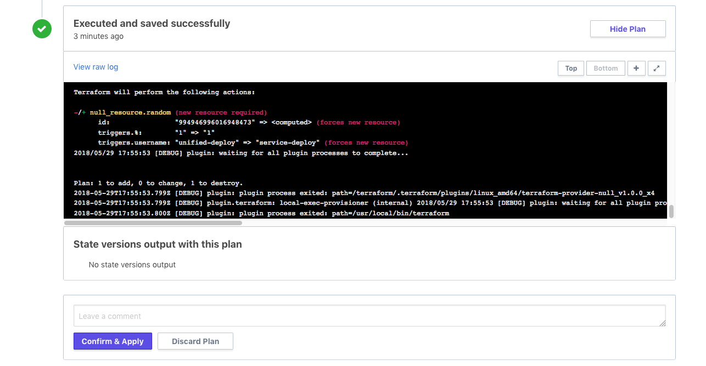

# The UI- and VCS-driven Run Workflow

Terraform Enterprise (TFE) has two workflows for managing Terraform runs.

- The simpler workflow, described below, is driven by TFE's UI and by integration with a supported VCS provider.
- [The more complex workflow](./run-api.html) is driven entirely by TFE's API, and lets you replace the UI and supported VCS providers with almost any kind of custom tooling.

## Summary

In the UI and VCS workflow, every workspace is associated with a specific branch of a VCS repo of Terraform configurations. TFE registers webhooks with your VCS provider when you create a workspace, then automatically queues a Terraform run whenever new commits are merged to the workspace's branch.

The Terraform code for a run always comes from version control, and is always associated with a specific commit.

## Starting Runs

Most of the time, you start a run automatically by committing changes to version control.

If the code in version control hasn't changed but you've modified some variables in TFE, you can also manually queue a plan from the UI. Each workspace has a "Queue Plan" button, and the form for editing variables also includes a "Save & Plan" button.

Manually queueing a plan requires write or admin access.

## Confirming or Discarding Plans

By default, run plans require confirmation before TFE will apply them. Users with write access on a workspace can visit the page for a run that has finished planning and click the "Confirm & Apply" or "Discard Plan" button to finish or cancel a run.

Users can also leave comments if there's something unusual involved in a run.

Note that until you apply or discard a plan, TFE can't start another run in that workspace.

### Auto apply

If you would rather automatically apply plans that don't have errors, you can enable auto apply on the workspace's settings tab.
